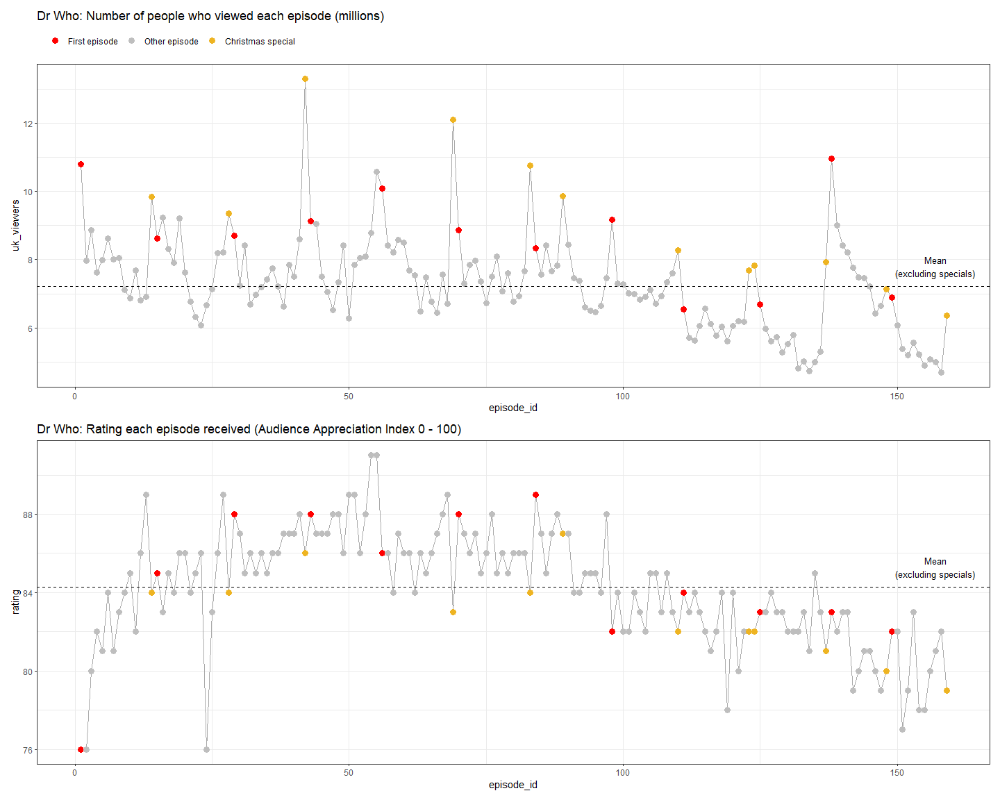

## Dr Who
The data this week is provided via the [`datardis` package](https://randomics.netlify.app/posts/2021-11-16-datardis/), with supplementary data from IMDb. There are four tables of data relating to Doctor Who episodes, directors, writers and IMDb ratings (new era only).  


### Objectives
This week I'm going to focus on the `episodes` data and look at the relationship between UK viewing figures (in the millions) and audience ratings (Audience Appreciation Index, ranging from 0 to 100). I'm curious to know if the Christmas special episodes look different from normal episodes.  


### Learning Points
The main things I learned about this week were:  

- **Annotations:** How to add annotation text / lines to an individual facet.  

- **Theme styling:** I spent a bit of time trying to style my chart with a Doctor Who-ish theme (with a small nod to Xmas).       

### Load Packages
Load the required packages.  


```r
library(lubridate)
library(patchwork)
library(showtext)
library(tidyverse)
```


### Import Data
I'm only going to use the `episodes` data. I could have loaded the `datardis` package and accessed the data that way, but I'm choosing to read it in from the TidyTuesday GitHub page.  


```r
episodes <- readr::read_csv(
  "https://raw.githubusercontent.com/rfordatascience/tidytuesday/master/data/2021/2021-11-23/episodes.csv"
  )
```

Let's have a quick look at the data.  


```r
view(episodes)

# Trying out Hmisc::describe() to summarise the data
Hmisc::describe(episodes)
```

```
## episodes 
## 
##  12  Variables      172  Observations
## --------------------------------------------------------------------------------
## era 
##        n  missing distinct    value 
##      172        0        1  revived 
##                   
## Value      revived
## Frequency      172
## Proportion       1
## --------------------------------------------------------------------------------
## season_number 
##        n  missing distinct     Info     Mean      Gmd      .05      .10 
##      165        7       13    0.994    6.582    4.095      1.0      2.0 
##      .25      .50      .75      .90      .95 
##      4.0      7.0     10.0     11.6     12.0 
## 
## lowest :  1  2  3  4  5, highest:  9 10 11 12 13
##                                                                             
## Value          1     2     3     4     5     6     7     8     9    10    11
## Frequency     13    14    14    14    13    14    15    12    14    14    11
## Proportion 0.079 0.085 0.085 0.085 0.079 0.085 0.091 0.073 0.085 0.085 0.067
##                       
## Value         12    13
## Frequency     11     6
## Proportion 0.067 0.036
## --------------------------------------------------------------------------------
## serial_title 
##        n  missing distinct    value 
##        6      166        1     Flux 
##                
## Value      Flux
## Frequency     6
## Proportion    1
## --------------------------------------------------------------------------------
## story_number 
##        n  missing distinct 
##      172        0      172 
## 
## lowest : 157  158  159  160a 160b, highest: 297b 297c 297d 297e 297f
## --------------------------------------------------------------------------------
## episode_number 
##        n  missing distinct     Info     Mean      Gmd      .05      .10 
##      160       12       13    0.994    6.375    4.189        1        2 
##      .25      .50      .75      .90      .95 
##        3        6        9       12       12 
## 
## lowest :  1  2  3  4  5, highest:  9 10 11 12 13
##                                                                             
## Value          1     2     3     4     5     6     7     8     9    10    11
## Frequency     15    15    14    14    14    13    12    12    12    12    10
## Proportion 0.094 0.094 0.088 0.088 0.088 0.081 0.075 0.075 0.075 0.075 0.062
##                       
## Value         12    13
## Frequency     10     7
## Proportion 0.062 0.044
## --------------------------------------------------------------------------------
## episode_title 
##        n  missing distinct 
##      171        1      171 
## 
## lowest : 42                     A Christmas Carol      A Good Man Goes to War A Town Called Mercy    Aliens of London      
## highest: Vincent and the Doctor Voyage of the Damned   War of the Sontarans   World Enough and Time  World War Three       
## --------------------------------------------------------------------------------
## type 
##        n  missing distinct 
##      172        0        2 
##                           
## Value      episode special
## Frequency      153      19
## Proportion    0.89    0.11
## --------------------------------------------------------------------------------
## first_aired 
##          n    missing   distinct       Info       Mean        Gmd        .05 
##        172          0        172          1 2012-06-25       2061 2005-05-24 
##        .10        .25        .50        .75        .90        .95 
## 2006-05-06 2008-04-10 2011-09-27 2015-12-10 2018-12-29 2020-02-19 
## 
## lowest : 2005-03-26 2005-04-02 2005-04-09 2005-04-16 2005-04-23
## highest: 2021-11-07 2021-11-14 2021-11-21 2021-11-28 2021-12-05
## --------------------------------------------------------------------------------
## production_code 
##        n  missing distinct 
##       87       85       60 
## 
## lowest : 1.1  1.11 1.12 1.13 1.2 , highest: 4.6  4.7  4.8  4.9  4X  
## --------------------------------------------------------------------------------
## uk_viewers 
##        n  missing distinct     Info     Mean      Gmd      .05      .10 
##      167        5      146        1     7.53    1.754    5.206    5.622 
##      .25      .50      .75      .90      .95 
##    6.550    7.370    8.220    9.284   10.798 
## 
## lowest :  4.69  4.73  4.82  4.90  4.99, highest: 12.11 12.27 12.80 13.10 13.31
## --------------------------------------------------------------------------------
## rating 
##        n  missing distinct     Info     Mean      Gmd      .05      .10 
##      168        4       15    0.989    84.19    3.438    78.35    80.00 
##      .25      .50      .75      .90      .95 
##    82.00    84.00    86.00    88.00    88.65 
## 
## lowest : 76 77 78 79 80, highest: 86 87 88 89 91
##                                                                             
## Value         76    77    78    79    80    81    82    83    84    85    86
## Frequency      4     2     3     4     6     8    19    20    19    19    25
## Proportion 0.024 0.012 0.018 0.024 0.036 0.048 0.113 0.119 0.113 0.113 0.149
##                                   
## Value         87    88    89    91
## Frequency     16    14     7     2
## Proportion 0.095 0.083 0.042 0.012
## --------------------------------------------------------------------------------
## duration 
##        n  missing distinct     Info     Mean      Gmd      .05      .10 
##      169        3       27    0.892    49.03    6.567     44.0     45.0 
##      .25      .50      .75      .90      .95 
##     45.0     45.0     50.0     60.0     62.2 
## 
## lowest : 41 42 43 44 45, highest: 71 72 75 76 77
## --------------------------------------------------------------------------------
```


### Explore /  Wrangle Data

First, I'd like to know a bit more about the special episodes.  


```r
# Q. Are special episodes part of the official seasons? 
# A. Not always (some have no season_number) 
#    Some seasons have no specials, while some seasons have more than one
#    All specials that are part of a season fall on either Xmas or NY day,
#    but this isn't always the case for specials that aren't part of a season
episodes %>%
  filter(type == "special") %>% 
  select(season_number, episode_number:first_aired, uk_viewers:duration) %>% 
  arrange(season_number)
```

```
## # A tibble: 19 x 8
##    season_number episode_number episode_title       type  first_aired uk_viewers
##            <dbl>          <dbl> <chr>               <chr> <date>           <dbl>
##  1             2             NA The Christmas Inva~ spec~ 2005-12-25        9.84
##  2             3             NA The Runaway Bride   spec~ 2006-12-25        9.35
##  3             4             NA Voyage of the Damn~ spec~ 2007-12-25       13.3 
##  4             6             NA A Christmas Carol   spec~ 2010-12-25       12.1 
##  5             7             NA The Doctor, the Wi~ spec~ 2011-12-25       10.8 
##  6             7             NA The Snowmen         spec~ 2012-12-25        9.87
##  7             9             NA Last Christmas      spec~ 2014-12-25        8.28
##  8             9             NA The Husbands of Ri~ spec~ 2015-12-25        7.69
##  9            10             NA The Return of Doct~ spec~ 2016-12-25        7.83
## 10            10             NA Twice Upon a Time   spec~ 2017-12-25        7.92
## 11            11             NA Resolution          spec~ 2019-01-01        7.13
## 12            12             NA Revolution of the ~ spec~ 2021-01-01        6.35
## 13            NA              1 The Next Doctor     spec~ 2008-12-25       13.1 
## 14            NA              2 Planet of the Dead  spec~ 2009-04-11        9.75
## 15            NA              3 The Waters of Mars  spec~ 2009-11-15       10.3 
## 16            NA              4 The End of Time – ~ spec~ 2009-12-25       12.0 
## 17            NA              5 The End of Time – ~ spec~ 2010-01-01       12.3 
## 18            NA              1 The Day of the Doc~ spec~ 2013-11-23       12.8 
## 19            NA              2 The Time of the Do~ spec~ 2013-12-25       11.1 
## # ... with 2 more variables: rating <dbl>, duration <dbl>
```

```r
# Q. Are all Xmas episodes special? 
# A. Yes
episodes %>%
  filter((day(first_aired) == 25 & month(first_aired) == 12) & type != "special") 
```

```
## # A tibble: 0 x 12
## # ... with 12 variables: era <chr>, season_number <dbl>, serial_title <chr>,
## #   story_number <chr>, episode_number <dbl>, episode_title <chr>, type <chr>,
## #   first_aired <date>, production_code <chr>, uk_viewers <dbl>, rating <dbl>,
## #   duration <dbl>
```

```r
# Q. Are all New Year's day episodes special? 
# A. No, one of them isn't - the first episode of season 12
episodes %>%
  filter((day(first_aired) == 1 & month(first_aired) == 1) & type != "special") %>% 
  select(season_number, episode_number:first_aired, uk_viewers:duration)
```

```
## # A tibble: 1 x 8
##   season_number episode_number episode_title type  first_aired uk_viewers rating
##           <dbl>          <dbl> <chr>         <chr> <date>           <dbl>  <dbl>
## 1            12              1 Spyfall, Par~ epis~ 2020-01-01        6.89     82
## # ... with 1 more variable: duration <dbl>
```

Having had a quick eye-ball of the data, I'm going to clear out the data I'm not interested in and create some new variables.  


```r
# Tidy-up the episodes table and create new variables
episodes_new <- episodes %>% 
  select(-era, -serial_title, -story_number, -production_code) %>% 
  # Only keep episodes / specials that are part of a season, 
  # but exclude those that are part of season 13 (it's still ongoing) 
  filter(!is.na(season_number) & season_number < 13) %>% 
  # Add a unique episode_id (ordered by when episode was first aired)
  arrange(first_aired) %>% 
  mutate(episode_id = row_number(), .before = season_number) %>% 
  # Add variable to flag special, first and other episodes  
  mutate(type_new = as_factor(case_when(
    type == "special" ~ "Christmas special",
    episode_number == 1 ~ "First episode",
    TRUE ~ "Other episode"
    )), .after = type)
```

Now I'm going to create an overall and a per season summary table, with mean viewers and ratings, grouped by episodes and specials.  


```r
# Overall summary
summary_overall <- episodes_new %>% 
  group_by(type) %>% 
  summarise(
    n_episodes = n(),
    mean_viewers = mean(uk_viewers),
    mean_rating = mean(rating)
  ) %>% 
  ungroup()

# Per season summary
summary_season <- episodes_new %>% 
  group_by(season_number, type) %>% 
  summarise(
    n_episodes = n(),
    mean_viewers = mean(uk_viewers),
    mean_rating = mean(rating),
  ) %>% 
  ungroup()
```

I'd like to get an overall sense of the peaks and troughs in viewers and ratings, so I'll create a quick plot to show the trend over time (highlighting first and special episodes).  I'll add a line showing the overall mean for viewers and ratings (excluding special episodes).  


```r
# Some initial formatting to make the charts easier to read
theme_set(theme_bw()) 
theme_update(
  legend.position = "top",
  legend.justification = "left"
  )
episode_type_colours = c("red", "grey", "goldenrod2")

# Viewers chart
p_viewers_1 <- episodes_new %>% 
  ggplot(aes(x = episode_id, y = uk_viewers)) +
  geom_line(colour = "darkgrey", size = 0.5) +
  # Highlight first and special episodes 
  geom_point(aes(colour = type_new), size = 3) +
  scale_colour_manual(values = episode_type_colours) +
  # Add line showing overall mean for episodes (excluding specials)
  geom_hline(data = filter(summary_overall, type == "episode"), 
             aes(yintercept = mean_viewers), 
             linetype = "dashed"
             ) +
  annotate("text", 157, 7.8, label = "Mean\n(excluding specials)", size = 3.5) +
  labs(title = "Dr Who: Number of people who viewed each episode (millions)",
       colour = ""
       )
  
# Ratings chart
p_ratings_1 <- episodes_new %>% 
  ggplot(aes(x = episode_id, y = rating)) +
  geom_line(colour = "darkgrey", size = 0.5) +
  geom_point(aes(colour = type_new), size = 3) +
  scale_colour_manual(values = episode_type_colours) +
  geom_hline(data = filter(summary_overall, type == "episode"), 
             aes(yintercept = mean_rating), 
             linetype = "dashed") +
  annotate("text", 157, 85.3, label = "Mean\n(excluding specials)", size = 3.5) +
  labs(title = "Dr Who: Rating each episode received (Audience Appreciation Index 0 - 100)",
       colour = ""
       )

# Patchwork is loaded, so patch the charts together
p_viewers_1 / 
  p_ratings_1 + plot_layout(guides = "collect")
```



I can see  that season openers and specials generally draw higher numbers of viewers than average episodes, but this doesn't always correspond to higher ratings. In fact, the specials often don't rate very highly.  

It also looks like some seasons performed better than others, so I'll take a closer look at how specials compare to other episodes within each season.  


```r
# Viewers
p_viewers_2 <- episodes_new %>% 
  ggplot() +
  geom_jitter(aes(x = factor(season_number), y = uk_viewers, colour = type_new),
              width = 0.15, height = 0, size = 3, alpha = 0.6) +
  scale_colour_manual(values = episode_type_colours) +
  # Add mean for each season
  geom_segment(data = filter(summary_season, type == "episode"), 
               aes(x = season_number + 0.3, xend = season_number - 0.3, y = mean_viewers, yend = mean_viewers),
               linetype = "dashed") +
  labs(title = "Dr Who: Number of people who viewed each episode, by season (millions)",
       subtitle = "Each dot represents one episode. Dashed line represents mean viewers each season (excluding specials).",
       colour = "")
    
# Ratings
p_ratings_2 <- episodes_new %>% 
  ggplot() +
  geom_jitter(aes(x = factor(season_number), y = rating, colour = type_new),
              width = 0.15, height = 0, size = 3, alpha = 0.6) +
  scale_colour_manual(values = episode_type_colours) +
  # Add mean for each season
  geom_segment(data = filter(summary_season, type == "episode"), 
               aes(x = season_number + 0.3, xend = season_number - 0.3, y = mean_rating, yend = mean_rating),
               linetype = "dashed") +
  labs(title = "Dr Who: Rating each episode received, by season (Audience Appreciation Index 0 - 100)",
       subtitle = "Each dot represents one episode. Dashed line represents mean rating each season (excluding specials).",
       colour = "")         

p_viewers_2 / 
  p_ratings_2 + plot_layout(guides = "collect")
```


### Visualise Data
It's clear from the charts above that special episodes do look a bit different to other episodes. For my final visualisation I'm going to use a scatter plot to show how each Christmas special compares to the other episodes within its own season. I think it's helpful to highlight the first episode in each season to provide some context.  

My plan is to build a panel of scatter plots, one plot (facet) for each season, and then style it with Doctor Who-ish colours.  

First, load the required fonts and then set-up the colours and theme.   


```r
# Fonts
showtext_auto(enable = TRUE)
font_add_google("Lato")
font_add_google("Playfair Display")
```

My colour inspiration was taken from the [Official 2022 Doctor Who Annual](https://cdn.waterstones.com/bookjackets/large/9781/4059/9781405948029.jpg).  


```r
# Colours
episode_type_colours = c("#EFDE02", "#DE4046", "#FFFFFF")
dr_who_blue_light = "#265773"
dr_who_blue_mid = "#204860"
dr_who_blue_dark = "#193A4D"
```


```r
# Theme
theme_set(theme_minimal())

theme_update(
  text = element_text(family = "Lato", size = 12, colour = dr_who_blue_dark),
  plot.title = element_text(family = "Playfair Display", size = 18, face = "bold", margin = margin(b = 10)),
  plot.subtitle = element_text(size = 12, margin = margin(b = 10), lineheight = 1.1),
  plot.caption = element_text(size = 10, margin = margin(t = 10), hjust = 0, lineheight = 1.),
  plot.background = element_rect(colour = NA, fill = "#FFFFFF"),
  plot.margin = margin(rep(10, 10)),
  strip.text = element_text(size = 12, colour = "#FFFFFF", face = "bold", hjust = 0.05),
  strip.background = element_rect(fill = dr_who_blue_light, colour = "#FFFFFF"),
  panel.background = element_rect(fill = dr_who_blue_light),
  panel.border = element_rect(fill = NA, colour = "#FFFFFF"),
  panel.grid.major = element_line(colour = dr_who_blue_mid, size = 0.5),
  panel.grid.minor = element_blank(),
  legend.position = "top",
  legend.justification = "left",
  legend.key = element_rect(fill = dr_who_blue_light, colour = dr_who_blue_light), 
  legend.key.size = unit(0.3, "inch"),
  legend.text = element_text(size = 12),
  legend.title = element_text(size = 12),
  axis.text = element_text(size = 12, colour = dr_who_blue_dark),
  axis.title.y = element_text(margin = margin(r = 10)),
  axis.title.x = element_text(margin = margin(t = 10, b = 10))
  )
```

I'm going to use facet_wrap(~season_number) to create a scatter plot facet for each season. I'd like to add some annotation to the first facet (Season 1) to help guide the reader in how to read the chart. To do this I'll set-up a tibble for the annotation text and one for the annotation lines. By recording the season number in these tibbles along with the relevant x / y co-ordinates I can pass this into ggplot and use facet_wrap to facet not just the data, but the annotations text and lines too.  


```r
# Annotation text
annotation_text <- tibble(
  x = c(73, 84.2),
  y = c(13, 13),
  label = c("High viewers\nLow rating", "Average"),
  season_number = c(1, 1),
)

# Annotation lines
annotation_line <- tibble(
  x = c(84, 87.5),
  xend = c(82.8, 87.5),
  y = c(13, 12.3),
  yend = c(13, 8.25),
  season_number = c(1, 1),
)

# Labels for facet strips (1 = Season 1 etc)
season_labels <- str_c("Season ", 1:12)
names(season_labels) <- c(1:12)
```

Now, build the final plot.  


```r
p_final <- ggplot() +
  # Mean lines
  geom_vline(data = filter(summary_season, type == "episode"), 
             aes(xintercept = mean_rating), linetype = "dashed", colour = "#FFFFFF", size = 0.5) +
  geom_hline(data = filter(summary_season, type == "episode"), 
             aes(yintercept = mean_viewers), linetype = "dashed", colour = "#FFFFFF", size = 0.5) +
  # Points
  geom_point(data = filter(episodes_new, type_new == "Other episode"), 
             aes(y = uk_viewers, x = rating, colour = type_new), alpha = 0.6, size = 2.5) +
  geom_point(data = filter(episodes_new, type_new != "Other episode"), 
             aes(y = uk_viewers, x = rating, colour = type_new), size = 3) +
  scale_colour_manual(values = episode_type_colours) +
  # Annotation text
  geom_label(data = annotation_text, 
             aes(x = x, y = y, label = label),
             colour = "#FFFFFF",
             fill = dr_who_blue_light,
             label.size = NA,
             size = 3.88,
             hjust = 0,
             vjust = 0.5
             ) +
  # Annotation lines
  geom_segment(data = annotation_line,
               aes(x = x, xend = xend , y = y, yend = yend),
               colour = "#FFFFFF",
               arrow = arrow(length = unit(0.08, "inch")), 
               size = 0.5
               ) +
  scale_x_continuous(limits = c(73, 92), breaks = seq(75, 90, 5)) +
  scale_y_continuous(limits = c(4, 14), breaks = seq(4, 14, 2)) +
  # Facet by season number and add season labels to each facet
  facet_wrap(~season_number, nrow = 3, labeller = labeller(season_number = season_labels)) +
  labs(title = "Doctor Who Christmas specials attract viewers, but are not highly rated",
       subtitle = "Rating received for each episode of Doctor Who when it first aired in the UK (Appreciation Index 0 - 100), versus the\nnumber of people, in millions, who viewed it. Each dot represents one episode in each season of the revived era.",
       x = "Rating (Audience Appreciation Index 0 - 100)",
       y = "Number of UK viewers (millions)",
       colour = "",
       caption = "Notes:\n(1) Average (mean) ratings and viewers exclude Christmas specials.\n(2) Season 1-10 Christmas specials aired on Christmas day. Season 11-12 Christmas specials aired on New Year's day.\n  \nTidy Tuesday: Week 48, 2021 | Data source: datardis package | Visualisation: @Fi_Lees") 

p_final
```


Save the plot as an image.  


```r
# Tell showtext to use DPI of 300 so text size is correct when chart is saved as an image
showtext_opts(dpi = 300)

ggsave("dr_who.png", p_final, width = 12, height = 11, units = "in", dpi = 300)

# Turn off showtext
showtext_auto(FALSE)
```


### Final Thoughts
My final chart isn't about showing exact figures, it's more about showing a general pattern (Christmas specials tend to attract higher numbers of viewers relative to other episodes within a season, but they also tend to rate below average). I'm guessing many of the viewers who tune into the Xmas specials are not die hard Dr Who fans.  

Seasons 11 and 12 (Jodie Whittaker) look a bit different though. Moving the Christmas special to New Year's day may have impacted viewing figures.  


### Session Information

```r
sessionInfo()
```

```
## R version 4.1.2 (2021-11-01)
## Platform: x86_64-w64-mingw32/x64 (64-bit)
## Running under: Windows 10 x64 (build 22000)
## 
## Matrix products: default
## 
## locale:
## [1] LC_COLLATE=English_United Kingdom.1252 
## [2] LC_CTYPE=English_United Kingdom.1252   
## [3] LC_MONETARY=English_United Kingdom.1252
## [4] LC_NUMERIC=C                           
## [5] LC_TIME=English_United Kingdom.1252    
## 
## attached base packages:
## [1] stats     graphics  grDevices utils     datasets  methods   base     
## 
## other attached packages:
##  [1] forcats_0.5.1   stringr_1.4.0   dplyr_1.0.7     purrr_0.3.4    
##  [5] readr_2.0.2     tidyr_1.1.4     tibble_3.1.5    ggplot2_3.3.5  
##  [9] tidyverse_1.3.1 showtext_0.9-4  showtextdb_3.0  sysfonts_0.8.5 
## [13] patchwork_1.1.1 lubridate_1.8.0
## 
## loaded via a namespace (and not attached):
##  [1] fs_1.5.0            bit64_4.0.5         RColorBrewer_1.1-2 
##  [4] httr_1.4.2          tools_4.1.2         backports_1.3.0    
##  [7] bslib_0.3.1         utf8_1.2.2          R6_2.5.1           
## [10] rpart_4.1-15        Hmisc_4.6-0         DBI_1.1.1          
## [13] colorspace_2.0-2    nnet_7.3-16         withr_2.4.2        
## [16] tidyselect_1.1.1    gridExtra_2.3       bit_4.0.4          
## [19] curl_4.3.2          compiler_4.1.2      textshaping_0.3.6  
## [22] cli_3.1.0           rvest_1.0.2         htmlTable_2.3.0    
## [25] xml2_1.3.2          labeling_0.4.2      sass_0.4.0         
## [28] checkmate_2.0.0     scales_1.1.1        systemfonts_1.0.3  
## [31] digest_0.6.28       foreign_0.8-81      rmarkdown_2.11     
## [34] base64enc_0.1-3     jpeg_0.1-9          pkgconfig_2.0.3    
## [37] htmltools_0.5.2     highr_0.9           dbplyr_2.1.1       
## [40] fastmap_1.1.0       htmlwidgets_1.5.4   rlang_0.4.12       
## [43] readxl_1.3.1        rstudioapi_0.13     farver_2.1.0       
## [46] jquerylib_0.1.4     generics_0.1.1      jsonlite_1.7.2     
## [49] vroom_1.5.5         magrittr_2.0.1      Formula_1.2-4      
## [52] Matrix_1.3-4        Rcpp_1.0.7          munsell_0.5.0      
## [55] fansi_0.5.0         lifecycle_1.0.1     stringi_1.7.5      
## [58] yaml_2.2.1          grid_4.1.2          parallel_4.1.2     
## [61] crayon_1.4.2        lattice_0.20-45     haven_2.4.3        
## [64] splines_4.1.2       hms_1.1.1           knitr_1.36         
## [67] pillar_1.6.4        reprex_2.0.1        glue_1.4.2         
## [70] evaluate_0.14       latticeExtra_0.6-29 data.table_1.14.2  
## [73] modelr_0.1.8        vctrs_0.3.8         png_0.1-7          
## [76] tzdb_0.2.0          cellranger_1.1.0    gtable_0.3.0       
## [79] assertthat_0.2.1    xfun_0.27           broom_0.7.10       
## [82] ragg_1.2.0          survival_3.2-13     cluster_2.1.2      
## [85] ellipsis_0.3.2
```


