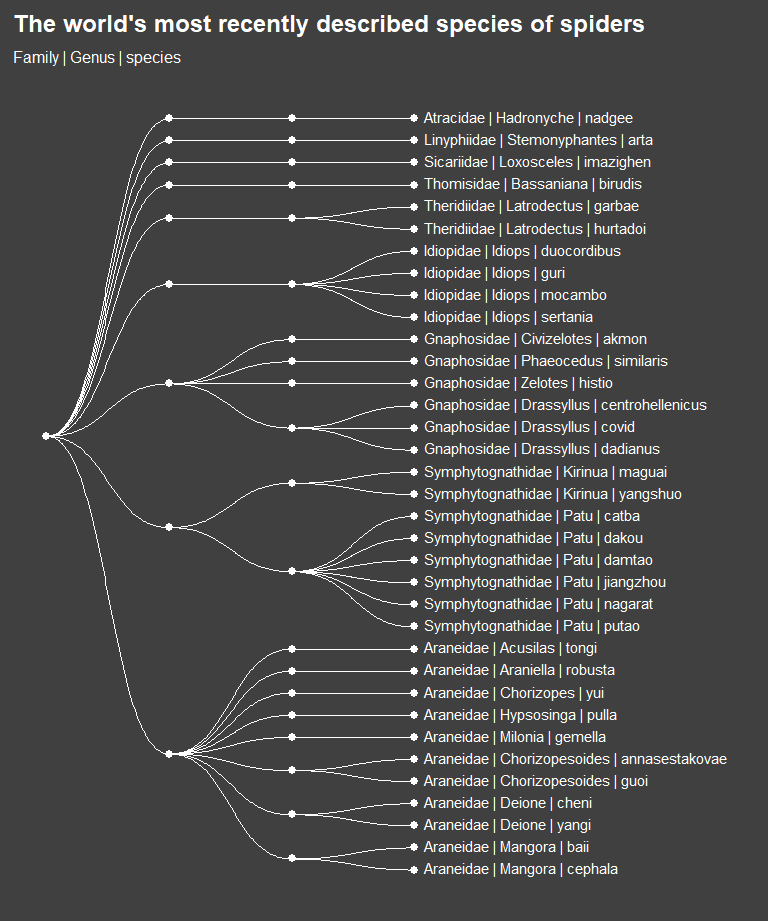
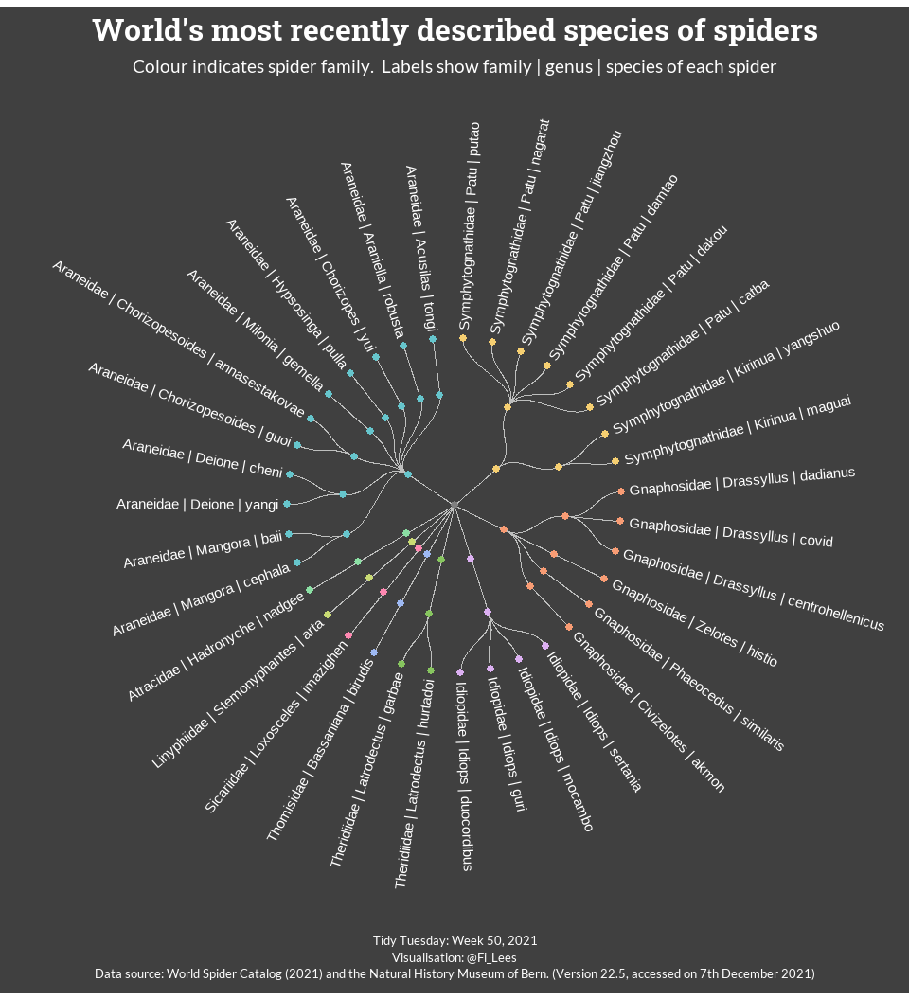

## Spiders
The data this week were extracted from the [World Spider Catalog (WSC)](https://wsc.nmbe.ch/). The WSC is a searchable online database covering spider taxonomy. It aims to provide listings of all currently valid species, genera, and families of spiders and all significant taxonomic references to each species. The catalog is continuously updated. The data used in this analysis was current as at 7th Dec 2021.  


### Objectives
This week I'm going to focus on learning how to produce a hierarchical **dendrogram**. A dendrogram (sometimes called a tree diagram) is a network structure. It consists of a root **node** (sometimes called a vertex), connected to a number of other nodes (vertices) via branches (sometimes called **edges**). The final nodes in the hierarchy are called **leaves**. The structure is ideal for showing hierarchical relationships, such as those between families, genera and species of spiders.  


### Learning Points
I've never tried to create a dendrogram before, but I saw a couple of great Tidy Tuesday examples ([1](https://twitter.com/BjnNowak/status/1468348695536193538), [2](https://twitter.com/ralitza_s/status/1468286479403212800)) that inspired me to give it a go.    

The main thing I learned about this week was the [`ggraph` package](https://www.data-imaginist.com/2017/announcing-ggraph/). `ggraph` is an extension of the ggplot2 API and supports relational data such as networks and trees. I've only scratched the surface of this amazing package, but that means I can look forward to learning even more about it in future weeks.  

I found a couple of online tutorials that helped me to wrangle the data ([1](https://www.r-graph-gallery.com/335-custom-ggraph-dendrogram.html), [2](https://www.data-to-viz.com/graph/dendrogram.html)), but I also found the [package documentation](https://cran.r-project.org/web/packages/ggraph/ggraph.pdf) helpful. When I got stuck, I did a bit of googling and found answers on [stackoverflow](https://stackoverflow.com/). 


### Load Packages


```r
library(showtext)
library(rcartocolor)
library(ggraph)
library(igraph)
library(tidyverse)
```


### Import Data


```r
spiders <- readr::read_csv(
  "https://raw.githubusercontent.com/rfordatascience/tidytuesday/master/data/2021/2021-12-07/spiders.csv"
  )
```

Let's have a quick look at the data.    


```r
view(spiders)

knitr::kable(
  summary(spiders)
)
```


|   |  speciesId   |species_lsid     |   family        |   genus         |  species        | subspecies      |   author        |     year    | parentheses   |distribution     |
|:--|:-------------|:----------------|:----------------|:----------------|:----------------|:----------------|:----------------|:------------|:--------------|:----------------|
|   |Min.   :    1 |Length:49785     |Length:49785     |Length:49785     |Length:49785     |Length:49785     |Length:49785     |Min.   :1757 |Min.   :0.0000 |Length:49785     |
|   |1st Qu.:12857 |Class :character |Class :character |Class :character |Class :character |Class :character |Class :character |1st Qu.:1910 |1st Qu.:0.0000 |Class :character |
|   |Median :25587 |Mode  :character |Mode  :character |Mode  :character |Mode  :character |Mode  :character |Mode  :character |Median :1978 |Median :0.0000 |Mode  :character |
|   |Mean   :26766 |NA               |NA               |NA               |NA               |NA               |NA               |Mean   :1959 |Mean   :0.2707 |NA               |
|   |3rd Qu.:38579 |NA               |NA               |NA               |NA               |NA               |NA               |3rd Qu.:2006 |3rd Qu.:1.0000 |NA               |
|   |Max.   :59774 |NA               |NA               |NA               |NA               |NA               |NA               |Max.   :2021 |Max.   :1.0000 |NA               |


### Explore Data

My initial plan was to look at the most recent spiders found in Britain. A quick Internet search suggests there should be around 650 species overall. However, when I try to find British spiders in the WSC, I only find 38 in total. Further eye-balling of the data reveals that some species I know to be in Britain (foe example, Agelenidae Agelena labyrinthica) are recorded with quite non-specific `distribution` information (e.g. Europe). This being the case, I don't think I can accurately identify all spiders found in Britain.  


```r
# Get spiders found in Britain
df_spiders_britain <- spiders %>% 
  filter(str_detect(distribution,"Britain") & !str_detect(distribution,"New Britain")) %>% 
  select(speciesId, family:subspecies, distribution)
```

I suspect similar issues will arise for many other countries, so I'm going to change tack and look at the most recently identified spiders in the whole WSC. 

I think the term "described" tends to be used rather than "discovered". So I'm going to (arbitrarily) look at the 35 most recently described species. This seems like a sensible number of species to try to fit into one chart; I don't want it to be too busy or too sparse.  


```r
# Get the 35 most recent spiders in the catalog
df_spiders_recent <- spiders %>% 
  arrange(speciesId) %>% 
  slice_tail(n = 35) %>% 
  select(speciesId, family:subspecies, distribution) %>% 
  group_by(family) %>% 
  mutate(n_in_family = n()) %>% 
  group_by(family, genus) %>% 
  mutate(n_in_genus = n()) %>% 
  ungroup() %>% 
  # Order in descending order of the number of spiders in each family and genus
  arrange(-n_in_family, -n_in_genus, desc(family), desc(genus), desc(species))

# Q. How many distinct families of spiders are included in the 35 most recent spiders list?
# A. Nine.
df_spiders_recent %>% 
  distinct(family)
```

```
## # A tibble: 9 x 1
##   family           
##   <chr>            
## 1 Araneidae        
## 2 Symphytognathidae
## 3 Gnaphosidae      
## 4 Idiopidae        
## 5 Theridiidae      
## 6 Thomisidae       
## 7 Sicariidae       
## 8 Linyphiidae      
## 9 Atracidae
```


### Wrangle Data
To draw a hierarchical dendrogram using the `ggraph` package, I need to format the data so that `ggraph` understands the hierarchy. 

First I need to create an **edge list**: a table with two columns (`from` and `to`) where each row defines a single connection. In the case of the spider data, this means I need to show all connections between `family` and `genus` and all connections between `genus` and `species`. There are no sub-species in my most recent spiders list, so I'm only going to go to species level.  

Before proceeding, I'm going to make one final update to my `df_spiders_recent` data. I'd like some flexibility in how I group / label the dendrogram later, so I'm going to store the preceding hierarchy in the genus and species columns, along with the actual genus and species.  


```r
df_spiders_recent <- df_spiders_recent %>% 
  mutate(genus = str_c(family, " | ", genus),
         species = str_c(genus, " | ", species))
```

I had another reason for this last step. I've noticed a species name doesn't always have a 1:1 mapping to a genus. Sometimes a species name can map to two or three genus. This isn't the case with my most recent spiders list, but there are many examples in the spiders dataset (run the code below for an example. If you want to see lots of examples take out the first filter).   


```r
spiders %>% 
  filter(family == "Actinopodidae") %>% 
  arrange(species, genus, family) %>% 
  select(speciesId, family:species) %>% 
  group_by(species) %>% 
  mutate(n_genus = n_distinct(genus)) %>% 
  filter(n_genus > 1)
```

```
## # A tibble: 2 x 5
## # Groups:   species [1]
##   speciesId family        genus     species  n_genus
##       <dbl> <chr>         <chr>     <chr>      <int>
## 1         8 Actinopodidae Actinopus insignis       2
## 2        33 Actinopodidae Missulena insignis       2
```

By including the preceding hierarchy in the genus and species columns of `df_spiders_recent` I am being super explicit about how family, genus and species connect to each other. This step isn't essential, but I choosing to do it this way.  

Now to make the edge list.


```r
# First, make a connection FROM a root node called 'Spider' TO each distinct spider family
df_family <- df_spiders_recent %>% 
  distinct(family) %>%
  mutate(from = "Spider", .before = family) %>% 
  rename(to = family)

# Next, make a connection FROM each family TO each distinct genus within that family
df_genus <- df_spiders_recent %>% 
  distinct(family, genus) %>% 
  rename(from = family, to = genus)

# Finally, make a connection FROM each genus TO each distinct species within that genus
df_species <- df_spiders_recent %>% 
  distinct(genus, species) %>% 
  rename(from = genus, to = species)

# Now bind all these connections together into a single data frame
edge_list <- rbind(df_family, df_genus, df_species)

# There are 64 separate edges (connections)
count(edge_list)
```

```
## # A tibble: 1 x 1
##       n
##   <int>
## 1    64
```

Next I'm going to create a node_list to store information about each node (vertex). I don't need this information to draw a basic dendrogram, but it will help me to customise it later. 


```r
# Create a list of all the unique nodes listed in the edge list
node_list <- data.frame(name = unique(c(edge_list$from, edge_list$to))) 

# There should be one more row in the node_list than there is in the edge_list
# This is because the root node "spider" has it's own row.
count(node_list)
```

```
##    n
## 1 65
```

```r
# Separate out family, genus and species again (might use for grouping / labelling later)
node_list <- node_list %>% 
  mutate(family = word(name, 1, sep = fixed(' | ')),
         genus = word(name, 2, sep = fixed(' | ')),
         species = word(name, 3, sep = fixed(' | '))
         )
```

The final wrangling required is to create a nested data frame containing the hierarchical data. I've used a function from the `igraph` package to create this. Each row in the nested data frame is a path from the root node to a leaf node.   


```r
# Create a nested graph object with the igraph library
nested_edge_list <- graph_from_data_frame(edge_list, vertices = node_list)
```

Okay, now I'm ready to try creating my first dendrogram using `ggraph`.


```r
# Pass the nested data to ggraph 
ggraph(nested_edge_list, layout = 'dendrogram', circular = FALSE) + 
  # Draw edges (lines)
  geom_edge_diagonal(colour = "#FFFFFF") +
  # Draw nodes (dots)
  geom_node_point(colour = "#FFFFFF", size = 2.5) +
  # Draw text (leaf labels only)
  geom_node_text(aes(label = name, filter = leaf), 
                 colour = "#FFFFFF", size = 3.88,
                 hjust = 0, nudge_y = 0.08, nudge_x = 0.1) +
  # Flip sideways
  coord_flip() +
  # Put the leaf nodes on the right-hand-side and create a bit of space for the labels
  scale_y_reverse(limits = c(NA, -2.5)) + 
  # Styling
  theme_void() +
  theme(
    text = element_text(size = 12, colour = "#FFFFFF"),
    plot.title = element_text(size = 18, face = "bold", margin = margin(b = 10)),
    plot.subtitle = element_text(size = 12, margin = margin(b = 10)),
    plot.background = element_rect(colour = "grey25", fill = "grey25"),
    plot.margin = margin(rep(10, 10))
    ) +
  # Titles
  labs(
      title = "The world's most recently described spider species",
      subtitle = "Family | Genus | species"
      )
```




### Visualise Data

Now my data is set-up and I have a rough idea of how ggraph works, I'm going to create my final visualisation.

First, I'll load the fonts I want to use.  


```r
# Fonts
showtext_auto(enable = TRUE)
font_add_google("Lato")
font_add_google("Roboto Slab")
```

I'd like to colour code the nodes by spider family (n = 9). I'll need a palette with nine discrete colours, plus one for the 'spider' root node. The Carto Colour palette I want to use has a neutral grey at the end of it that I can make use of for the spider node. 


```r
# Colours
colours_family <- c(carto_pal(10, "Pastel"))
# Set "spider" root node to the neutral grey at the end of the colour palette.
names(colours_family) <- c(df_family$to, "spider")
```

Now to build the final visualisation.


```r
# Pass the nested data to ggraph and set circular to true
p_final <- ggraph(nested_edge_list, layout = 'dendrogram', circular = TRUE) + 
  # Edges
  geom_edge_diagonal2(colour = "grey75") +
  # Nodes (coloured by family)
  geom_node_point(aes(colour = family), size = 2.5) +
  # Labels
  geom_node_text(aes(x = x * 1.05, y = y * 1.05, # Put some space between node and label
                     label = name, 
                     filter = leaf, # Only label leaf nodes
                     angle = -((-node_angle(x, y) + 90) %% 180) + 90, # Adjust angle to aid reading
                     hjust = 'outward'
                     ), 
                 colour = "#FFFFFF", size = 3.88
                 ) +
  # Apply colour palette
  scale_color_manual(values = colours_family) +
  # Make some space for the labels
  xlim(-2.4, 2.4) +
  ylim(-2.3, 2.3) +
  coord_fixed() +
  # Styling
  theme_void() +
  theme(
    text = element_text(family = "Lato", size = 12, colour = "#FFFFFF"),
    plot.title = element_text(family = "Roboto Slab", size = 24, face = "bold", 
                              margin = margin(b = 10), hjust = 0.5),
    plot.subtitle = element_text(size = 14, margin = margin(b = 5), hjust = 0.5, lineheight = 1.1),
    plot.caption = element_text(size = 10, hjust = 0.5, lineheight = 1.1),
    plot.background = element_rect(colour = "grey25", fill = "grey25"),
    plot.margin = margin(rep(10, 10)),
    legend.position = "none"
  ) +
  # Titles
  labs(title = "The world's most recently described spider species",
       subtitle = "Colour indicates spider family.  Labels show family | genus | species of each spider",
       caption = "Tidy Tuesday: Week 50, 2021\nVisualisation: @Fi_Lees\nData source: World Spider Catalog (2021) and the Natural History Museum of Bern. (Version 22.5, accessed on 7th December 2021)"
       )
 
p_final
```



Save the plot as an image.  


```r
# Tell showtext to use DPI of 300 so text size is correct when chart is saved as an image
showtext_opts(dpi = 300)

# Save plot as image
ggsave("recent_spiders.png", p_final, width = 10, height = 11, units = "in", dpi = 300)

# Turn off showtext
showtext_auto(FALSE)
```


### Session Information

```r
sessionInfo()
```

```
## R version 4.1.2 (2021-11-01)
## Platform: x86_64-w64-mingw32/x64 (64-bit)
## Running under: Windows 10 x64 (build 22000)
## 
## Matrix products: default
## 
## locale:
## [1] LC_COLLATE=English_United Kingdom.1252 
## [2] LC_CTYPE=English_United Kingdom.1252   
## [3] LC_MONETARY=English_United Kingdom.1252
## [4] LC_NUMERIC=C                           
## [5] LC_TIME=English_United Kingdom.1252    
## 
## attached base packages:
## [1] stats     graphics  grDevices utils     datasets  methods   base     
## 
## other attached packages:
##  [1] forcats_0.5.1     stringr_1.4.0     dplyr_1.0.7       purrr_0.3.4      
##  [5] readr_2.0.2       tidyr_1.1.4       tibble_3.1.5      tidyverse_1.3.1  
##  [9] igraph_1.2.9      ggraph_2.0.5      ggplot2_3.3.5     rcartocolor_2.0.0
## [13] showtext_0.9-4    showtextdb_3.0    sysfonts_0.8.5   
## 
## loaded via a namespace (and not attached):
##  [1] fs_1.5.0           lubridate_1.8.0    bit64_4.0.5        httr_1.4.2        
##  [5] tools_4.1.2        backports_1.3.0    bslib_0.3.1        utf8_1.2.2        
##  [9] R6_2.5.1           DBI_1.1.1          colorspace_2.0-2   withr_2.4.3       
## [13] tidyselect_1.1.1   gridExtra_2.3      bit_4.0.4          curl_4.3.2        
## [17] compiler_4.1.2     textshaping_0.3.6  cli_3.1.0          rvest_1.0.2       
## [21] xml2_1.3.2         labeling_0.4.2     sass_0.4.0         scales_1.1.1      
## [25] systemfonts_1.0.3  digest_0.6.28      rmarkdown_2.11     pkgconfig_2.0.3   
## [29] htmltools_0.5.2    dbplyr_2.1.1       fastmap_1.1.0      highr_0.9         
## [33] rlang_0.4.12       readxl_1.3.1       rstudioapi_0.13    jquerylib_0.1.4   
## [37] farver_2.1.0       generics_0.1.1     jsonlite_1.7.2     vroom_1.5.5       
## [41] magrittr_2.0.1     Rcpp_1.0.7         munsell_0.5.0      fansi_0.5.0       
## [45] viridis_0.6.2      lifecycle_1.0.1    stringi_1.7.5      yaml_2.2.1        
## [49] MASS_7.3-54        grid_4.1.2         parallel_4.1.2     ggrepel_0.9.1     
## [53] crayon_1.4.2       graphlayouts_0.7.2 haven_2.4.3        hms_1.1.1         
## [57] knitr_1.36         pillar_1.6.4       reprex_2.0.1       glue_1.4.2        
## [61] evaluate_0.14      modelr_0.1.8       vctrs_0.3.8        tzdb_0.2.0        
## [65] tweenr_1.0.2       cellranger_1.1.0   gtable_0.3.0       polyclip_1.10-0   
## [69] assertthat_0.2.1   xfun_0.27          ggforce_0.3.3      broom_0.7.10      
## [73] tidygraph_1.2.0    ragg_1.2.0         viridisLite_0.4.0  ellipsis_0.3.2
```


