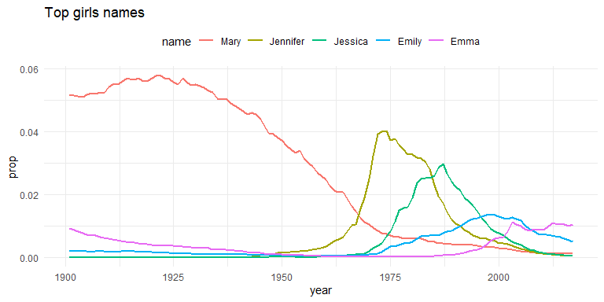
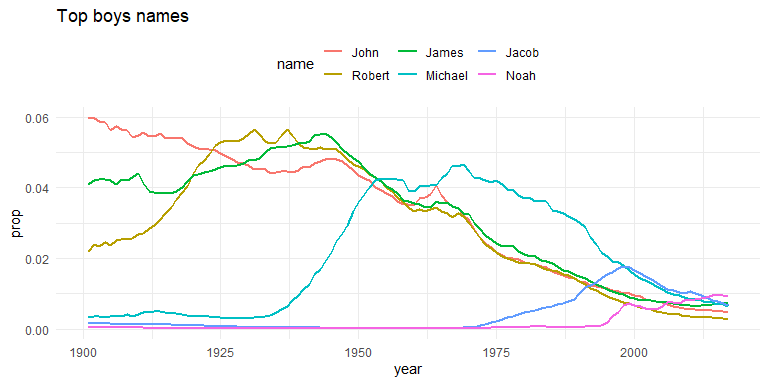
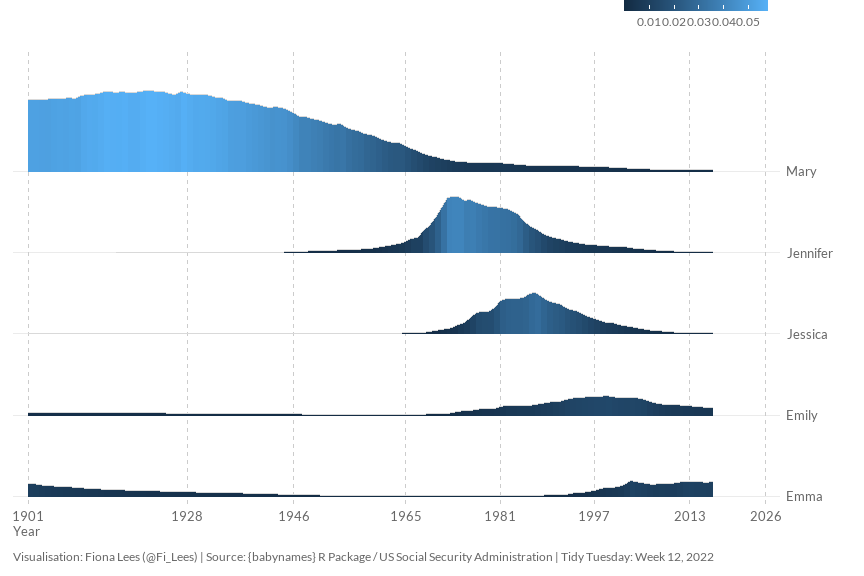
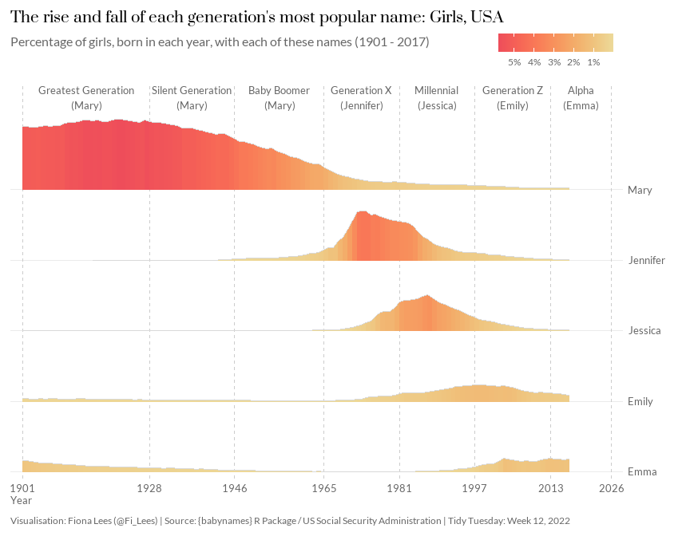
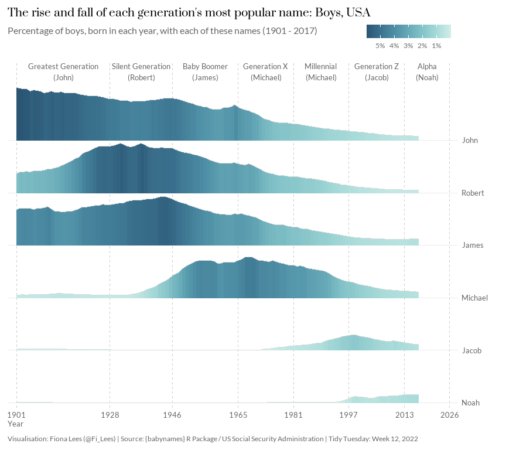

## Baby Names (USA)
The [data](http://hadley.github.io/babynames/) this week comes from Hadley Wickham's `{babynames}` package. The package contains three datasets provided by the US Social Security Administration (SSA):     
- `babynames`: The number of children of each sex given each name (1880 - 2017). Only includes names used >5 times.   
- `applicants`: The number of applicants for social security numbers, for each year, for each sex.  
- `lifetables`: Cohort life tables data.  

It also includes the following data from the US Census:  
- `births`: Number of live births by year, up to 2017.  


### Objectives
This week my goal is to find the most popular name in each generation (male and female) and then look at how each name's popularity has changed across the generations (1901 - 2017).  


### Learning Points
The main things I learned about this week were:  

- **{babynames}:** I've used the `babynames` package a few times in the past, while working my way through [R4DS](https://r4ds.had.co.nz/), but I haven't really looked at it in any detail. One of the things I hadn't really understood until now was how the `prop` variable was calculated. The official package notes describe this variable as: "n divided by total number of applicants in that year, which means proportions are of people of that sex with that name born in that year". However, the data dictionary on the #TidyTuesday web page, describes this variable as "Proportion of total births for that year". I was confused, so I spent a little time looking at this to make sure I understand what `prop` really means.  

- **{ggridges}:** I wanted to try creating a ridgeline plot and I found a great package called `ggridges` that makes creating this type of chart fairly straightforward. It took me a wee while to decide which geom to use. I wanted a ridgeline rather than a density plot, so at first I used geom_ridgeline_gradient(). However, in the end I found it easier to scale my charts by using geom_density_ridges_gradient(). It's possible to draw ridgelines with geom_density_ridges_gradient() by setting the stat = "identity". The [package notes](https://wilkelab.org/ggridges/index.html) were really useful in helping me to work through this. 


### Load Packages


```r
library(ggridges)
library(rcartocolor)
library(showtext)
library(tidyverse)
```


### Import Data

I'm going to pull the data in directly from {babynames}.  


```r
babynames_usa <- babynames::babynames
applicants_usa <- babynames::applicants
births_usa <- babynames::births
```

Let's have a quick look at the data.      


```r
#view(babynames_usa)
knitr::kable(summary(babynames_usa))
```


|   |     year    |    sex          |    name         |      n         |     prop         |
|:--|:------------|:----------------|:----------------|:---------------|:-----------------|
|   |Min.   :1880 |Length:1924665   |Length:1924665   |Min.   :    5.0 |Min.   :2.260e-06 |
|   |1st Qu.:1951 |Class :character |Class :character |1st Qu.:    7.0 |1st Qu.:3.870e-06 |
|   |Median :1985 |Mode  :character |Mode  :character |Median :   12.0 |Median :7.300e-06 |
|   |Mean   :1975 |NA               |NA               |Mean   :  180.9 |Mean   :1.363e-04 |
|   |3rd Qu.:2003 |NA               |NA               |3rd Qu.:   32.0 |3rd Qu.:2.288e-05 |
|   |Max.   :2017 |NA               |NA               |Max.   :99686.0 |Max.   :8.155e-02 |

```r
#view(applicants_usa)
knitr::kable(summary(applicants_usa))
```


|   |     year    |    sex          |    n_all       |
|:--|:------------|:----------------|:---------------|
|   |Min.   :1880 |Length:276       |Min.   :  97605 |
|   |1st Qu.:1914 |Class :character |1st Qu.: 768296 |
|   |Median :1948 |Mode  :character |Median :1613528 |
|   |Mean   :1948 |NA               |Mean   :1323697 |
|   |3rd Qu.:1983 |NA               |3rd Qu.:1957507 |
|   |Max.   :2017 |NA               |Max.   :2213423 |

```r
#view(births_usa)
knitr::kable(summary(births_usa))
```


|   |     year    |    births      |
|:--|:------------|:---------------|
|   |Min.   :1909 |Min.   :2307000 |
|   |1st Qu.:1936 |1st Qu.:2944000 |
|   |Median :1963 |Median :3637000 |
|   |Mean   :1963 |Mean   :3478766 |
|   |3rd Qu.:1990 |3rd Qu.:3988076 |
|   |Max.   :2017 |Max.   :4316233 |


### Explore / Wrangle Data

My first big question is, what does the `prop` variable actually tell us? I know it shows the proportion of babies given a certain name in a certain year, but what's the denominator? Is it a proportion of **all babies** (male and female) or of **all babies of that sex**?


```r
# Q: Is the denominator for `prop` all babies or babies of that sex?
# A: Must be babies of that sex - proportions for each sex add up to 0.92 - 0.94 
# (Note that names used <5 times are not included, so `prop` is never going to total 1.0)
babynames_usa %>% 
  group_by(year, sex) %>% 
  summarise(
    total_n = sum(n), 
    total_prop = sum(prop)
    )
```

```
## # A tibble: 276 x 4
## # Groups:   year [138]
##     year sex   total_n total_prop
##    <dbl> <chr>   <int>      <dbl>
##  1  1880 F       90993      0.932
##  2  1880 M      110491      0.933
##  3  1881 F       91953      0.930
##  4  1881 M      100743      0.930
##  5  1882 F      107847      0.932
##  6  1882 M      113686      0.932
##  7  1883 F      112319      0.936
##  8  1883 M      104627      0.930
##  9  1884 F      129020      0.938
## 10  1884 M      114442      0.932
## # ... with 266 more rows
```

Okay, the small piece of analysis above indicates the denominator must be babies of that sex, but I still don't fully understand what figures were used to calculate each proportion. Is the denominator in the `births` data? I don't think so.


```r
# Q: Is the denominator in the `births` data?
# A: No, I don't thinks so - this information isn't split by sex
births_usa
```

```
## # A tibble: 109 x 2
##     year  births
##    <int>   <int>
##  1  1909 2718000
##  2  1910 2777000
##  3  1911 2809000
##  4  1912 2840000
##  5  1913 2869000
##  6  1914 2966000
##  7  1915 2965000
##  8  1916 2964000
##  9  1917 2944000
## 10  1918 2948000
## # ... with 99 more rows
```

Can the denominator be found in the `applicants` data? I think maybe it can, let's check a few years of data.


```r
# Q: Is the denominator in the `applicants` data?
# A: Perhaps, this data is split by sex.
applicants_usa
```

```
## # A tibble: 276 x 3
##     year sex    n_all
##    <int> <chr>  <int>
##  1  1880 F      97605
##  2  1880 M     118400
##  3  1881 F      98855
##  4  1881 M     108282
##  5  1882 F     115695
##  6  1882 M     122031
##  7  1883 F     120059
##  8  1883 M     112477
##  9  1884 F     137586
## 10  1884 M     122738
## # ... with 266 more rows
```

```r
# Let's try calculating the proportion for a few examples and then cross check the result against 'babynames_usa$prop'.
# Hurray! 
# 'babynames_usa$prop' = proportion of all applicants of that sex in that year (applicants_usa$n_all) that had that name (babynames_usa$n).
babynames_usa %>% 
  filter(name == "Ashley", year %in% c(1901, 1952, 1983, 2015)) %>% 
  left_join(applicants_usa, by = c("year", "sex")) %>% 
  mutate(
    prop_2 = n / n_all,
    prop_check = near(prop,prop_2)
  )
```

```
## # A tibble: 7 x 8
##    year sex   name       n      prop   n_all    prop_2 prop_check
##   <dbl> <chr> <chr>  <int>     <dbl>   <int>     <dbl> <lgl>     
## 1  1901 M     Ashley    10 0.0000865  115595 0.0000865 TRUE      
## 2  1952 F     Ashley    24 0.0000126 1902276 0.0000126 TRUE      
## 3  1952 M     Ashley    59 0.0000299 1974199 0.0000299 TRUE      
## 4  1983 F     Ashley 33293 0.0186    1789354 0.0186    TRUE      
## 5  1983 M     Ashley   595 0.000319  1863331 0.000319  TRUE      
## 6  2015 F     Ashley  3423 0.00176   1945317 0.00176   TRUE      
## 7  2015 M     Ashley    26 0.0000128 2038331 0.0000128 TRUE
```

Now that we've established that 'prop' is the proportion of all SSA applicants of that sex in that year that had that name, it's time to move on to data prep.  

My first data prep task is to assign each year to a generation. There are conflicting views on which years should be included in each generation. I'm going to go with the definitions suggested by the [Pew Research Centre](https://www.pewresearch.org/fact-tank/2019/01/17/where-millennials-end-and-generation-z-begins).


```r
# Assign each year to a generation. Drop years before 1901.
baby_usa_1901_onwards <- babynames_usa %>% 
  filter(year >= 1901) %>% 
  mutate(generation = case_when(
    between(year, 1901, 1927) ~ "Greatest Generation",
    between(year, 1928, 1945) ~ "Silent Generation",
    between(year, 1946, 1964) ~ "Baby Boomer",
    between(year, 1965, 1980) ~ "Generation X",
    between(year, 1981, 1996) ~ "Millennial",
    between(year, 1997, 2012) ~ "Generation Z",
    between(year, 2013, 2025) ~ "Alpha"
  ))

# Create a quick generation summary table
# Looks like there is more diversity in names amongst the most recent generations 
# (remember we're only in the middle of Alpha)
baby_usa_1901_onwards %>% 
  group_by(generation) %>% 
  summarise(
    min_year = min(year),
    max_year = max(year),
    unique_names = n_distinct(name)
    ) %>% 
  arrange(min_year) %>% 
  ungroup()
```

```
## # A tibble: 7 x 4
##   generation          min_year max_year unique_names
##   <chr>                  <dbl>    <dbl>        <int>
## 1 Greatest Generation     1901     1927        17144
## 2 Silent Generation       1928     1945        16286
## 3 Baby Boomer             1946     1964        20694
## 4 Generation X            1965     1980        31670
## 5 Millennial              1981     1996        46623
## 6 Generation Z            1997     2012        63518
## 7 Alpha                   2013     2017        45235
```

Next, lets find the top male and female name for each generation. I'm choosing to define **top** as the name with the highest **number** of people called that name in a generation.


```r
# Summary table showing the top male and female name in each generation
top_gen_names_summary <- baby_usa_1901_onwards %>% 
  group_by(generation, sex, name) %>% 
  summarise(
    min_year = min(year),
    max_year = max(year),
    n_with_name = sum(n),
    ) %>% 
  slice(which(n_with_name == max(n_with_name))) %>% 
  arrange(min_year, sex) %>% 
  ungroup()

# Vector with the top female names
top_f <- top_gen_names_summary %>% 
  filter(sex == "F") %>% 
  pull(name)

# Vector with the top male names
top_m <- top_gen_names_summary %>% 
  filter(sex == "M") %>% 
  pull(name)
```

Create babyname datasets (one for female, one for male) showing the most popular names.


```r
# Create babynames dataset showing only the most popular female names
top_gen_names_f <- baby_usa_1901_onwards %>% 
  filter(sex == "F" & name %in% top_f) %>% 
  mutate(name = factor(name, levels = unique(top_f))) %>% 
  arrange(name, year)

# Create babynames dataset showing only the most popular male names
top_gen_names_m <- baby_usa_1901_onwards %>% 
  filter(sex == "M" & name %in% top_m) %>% 
  mutate(name = factor(name, levels = unique(top_m))) %>% 
  arrange(name, year)
```

Right, I think we have what we need now. Lets' draw a quick couple of charts to see what we have.


```r
top_gen_names_f %>% 
  ggplot(aes(x = year, y = prop, colour = name)) +
  geom_line(size = 1) +
  theme_minimal() +
  theme(
    legend.position = "top"
  ) +
  labs(title = "Top girls names")
```




```r
top_gen_names_m %>% 
  ggplot(aes(x = year, y = prop, colour = name)) +
  geom_line(size = 1) +
  theme_minimal() +
  theme(
    legend.position = "top"
  ) +
  labs(title = "Top boys names")
```




### Visualise Data
I'm ready to start building my final visualisations now.  

First, I'll load the fonts I want to use.  


```r
# Fonts
showtext_auto(enable = TRUE)
font_add_google("Lato")
font_add_google("Prata")
```

Next I'm going to create some annotation text to identify each generation and the top name within it.


```r
# Annotation text
annotation_text <- top_gen_names_summary %>% 
  mutate(
    label = str_c(generation, "\n(", name, ")"),
    max_year = ifelse(max_year == 2017, 2025, max_year),
    x = min_year + (((max_year + 1) - min_year) / 2),
    y = ifelse(sex == "F", "Mary", "John")
  )
```

I'm going to create two charts, one for girls and one for boys. First I'll create a base chart which will act as a foundation for both of my final charts.  


```r
p_base <- top_gen_names_f %>% 
  ggplot() +
  # Ridge line plot
  geom_density_ridges_gradient(
    aes(x = year, y = fct_rev(name), height = prop, fill = prop), 
    stat = "identity", 
    scale = 1, 
    colour = "grey85"
    ) +
  # Scales
  scale_x_continuous(
    limits = c(1901, 2026), 
    breaks = c(1901, 1928, 1946, 1965, 1981, 1997, 2013, 2026),
    expand = c(0.02, 0, 0.02, 0)
    ) +
  scale_y_discrete(
    expand = expansion(add = c(0.1, 1.5)),
    position = "right"
    ) +
  # Styling
  theme_minimal() +
  theme(
    text = element_text(family = "Lato", colour = "grey40", size = 12),
    plot.title = element_text(family = "Prata", colour = "black", size = 14, 
                              face = "bold", margin = margin(b = 10), hjust = 0),
    plot.subtitle = element_text(size = 12, hjust = 0),
    plot.caption = element_text(size = 9, margin = margin(t = 10), hjust = 0),
    plot.background = element_rect(colour = "white", fill = "white"),
    plot.margin = margin(t = 10, r = 10, b = 10, l = 10),
    panel.grid.minor = element_blank(),
    panel.grid.major.x = element_line(linetype = "dashed", colour = "grey80"),
    axis.text = element_text(size = 10, colour = "grey40"),
    axis.title = element_text(size = 10, colour = "grey40", hjust = 0),
    legend.position = "top",
    legend.justification = 0.98,
    legend.key.width = unit(0.3,"inch"),
    legend.text = element_text(size = 9),
    legend.margin = margin(t = 0, r = 0, b = 0, l = 0),
    legend.box.margin = margin(t = -20, r = 0, b = 5, l = 0)
    ) +
  # Titles
  labs(
    x = "Year",
    y = "",
    fill = "",
    caption = "Visualisation: Fiona Lees (@Fi_Lees) | Source: {babynames} R Package / US Social Security Administration | Tidy Tuesday: Week 12, 2022"
    )

p_base
```



Now I'll create the final chart for girls.


```r
# Chart for girls 
p_final_f <- p_base +
  # Fill colour for ridges
  scale_fill_carto_c(
    palette = "OrYel", 
    labels = scales::label_percent(accuracy = 1), 
    guide = guide_colourbar(reverse = TRUE)
    ) +
  # Annotation text
  geom_text(
    data = filter(annotation_text,sex == "F"),
    aes(x = x, y = y, label = label),
    family = "Lato",
    colour = "grey40",
    nudge_y = 1.3,
    size = 3.4,
    hjust = 0.5
    ) +
  # Titles
  labs(
    title = "The rise and fall of each generation's most popular name: Girls, USA",
    subtitle = "Percentage of girls, born in each year, with each of these names (1901 - 2017)"
    )
  
p_final_f
```



Finally, the chart for boys.


```r
# Chart for boys
# Update base plot with data for males
p_final_m <- p_base %+% top_gen_names_m +
  # Fill colour for ridges
  scale_fill_carto_c(
    palette = "Teal", 
    labels = scales::label_percent(accuracy = 1), 
    guide = guide_colourbar(reverse = TRUE)
    ) +
  # Annotation text
  geom_text(
    data = filter(annotation_text,sex == "M"),
    aes(x = x, y = y, label = label),
    family = "Lato",
    colour = "grey40",
    nudge_y = 1.3,
    size = 3.4,
    hjust = 0.5
    ) +
  # Titles
  labs(
    title = "The rise and fall of each generation's most popular name: Boys, USA",
    subtitle = "Percentage of boys, born in each year, with each of these names (1901 - 2017)"
    )
  
p_final_m
```



Save the plots as images.  


```r
# Tell showtext to use DPI of 320 so text size is correct when chart is saved as an image
showtext_opts(dpi = 320)

# Save plots as image
ggsave("girl_names.png", p_final_f, width = 9, height = 7, units = "in", dpi = 320)
ggsave("boy_names.png", p_final_m, width = 9, height = 8, units = "in", dpi = 320)

# Turn off showtext
showtext_auto(FALSE)
```


### Session Information

```r
sessionInfo()
```

```
## R version 4.1.3 (2022-03-10)
## Platform: x86_64-w64-mingw32/x64 (64-bit)
## Running under: Windows 10 x64 (build 22000)
## 
## Matrix products: default
## 
## locale:
## [1] LC_COLLATE=English_United Kingdom.1252 
## [2] LC_CTYPE=English_United Kingdom.1252   
## [3] LC_MONETARY=English_United Kingdom.1252
## [4] LC_NUMERIC=C                           
## [5] LC_TIME=English_United Kingdom.1252    
## 
## attached base packages:
## [1] stats     graphics  grDevices utils     datasets  methods   base     
## 
## other attached packages:
##  [1] forcats_0.5.1     stringr_1.4.0     dplyr_1.0.8       purrr_0.3.4      
##  [5] readr_2.1.2       tidyr_1.2.0       tibble_3.1.6      ggplot2_3.3.5    
##  [9] tidyverse_1.3.1   showtext_0.9-5    showtextdb_3.0    sysfonts_0.8.8   
## [13] rcartocolor_2.0.0 ggridges_0.5.3   
## 
## loaded via a namespace (and not attached):
##  [1] Rcpp_1.0.8.3      lubridate_1.8.0   assertthat_0.2.1  digest_0.6.29    
##  [5] utf8_1.2.2        R6_2.5.1          cellranger_1.1.0  plyr_1.8.6       
##  [9] backports_1.4.1   reprex_2.0.1      evaluate_0.15     highr_0.9        
## [13] httr_1.4.2        pillar_1.7.0      rlang_1.0.2       curl_4.3.2       
## [17] readxl_1.3.1      rstudioapi_0.13   jquerylib_0.1.4   babynames_1.0.1  
## [21] rmarkdown_2.13    textshaping_0.3.6 labeling_0.4.2    munsell_0.5.0    
## [25] broom_0.7.12      compiler_4.1.3    modelr_0.1.8      xfun_0.30        
## [29] systemfonts_1.0.4 pkgconfig_2.0.3   htmltools_0.5.2   tidyselect_1.1.2 
## [33] fansi_1.0.2       crayon_1.5.0      tzdb_0.2.0        dbplyr_2.1.1     
## [37] withr_2.5.0       grid_4.1.3        jsonlite_1.8.0    gtable_0.3.0     
## [41] lifecycle_1.0.1   DBI_1.1.2         magrittr_2.0.2    scales_1.1.1     
## [45] cli_3.2.0         stringi_1.7.6     farver_2.1.0      fs_1.5.2         
## [49] xml2_1.3.3        bslib_0.3.1       ragg_1.2.2        ellipsis_0.3.2   
## [53] generics_0.1.2    vctrs_0.3.8       tools_4.1.3       glue_1.6.2       
## [57] hms_1.1.1         fastmap_1.1.0     yaml_2.3.5        colorspace_2.0-3 
## [61] rvest_1.0.2       knitr_1.37        haven_2.4.3       sass_0.4.0
```

