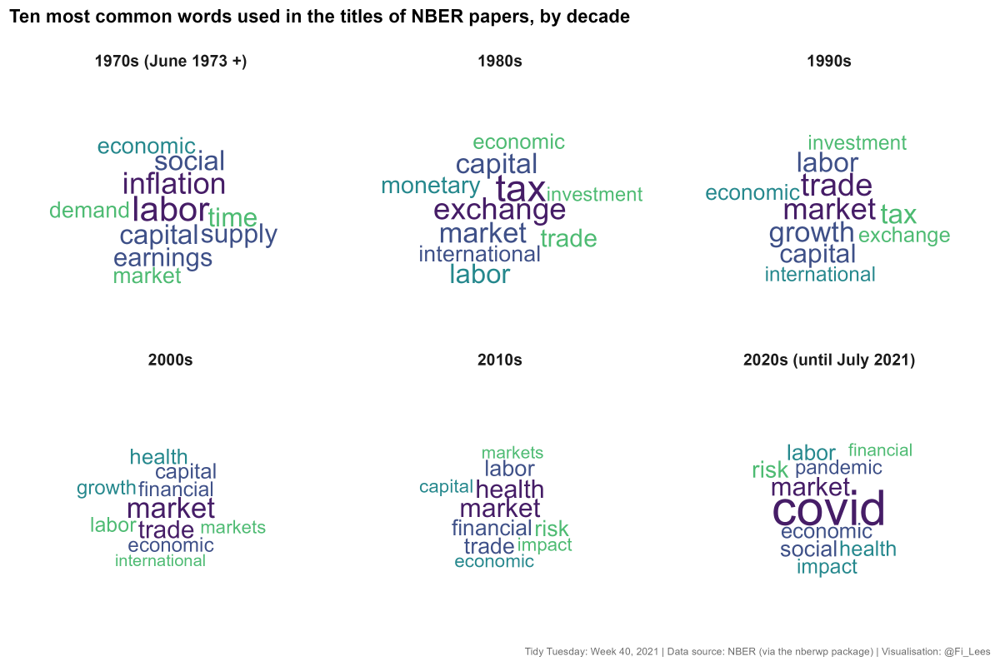
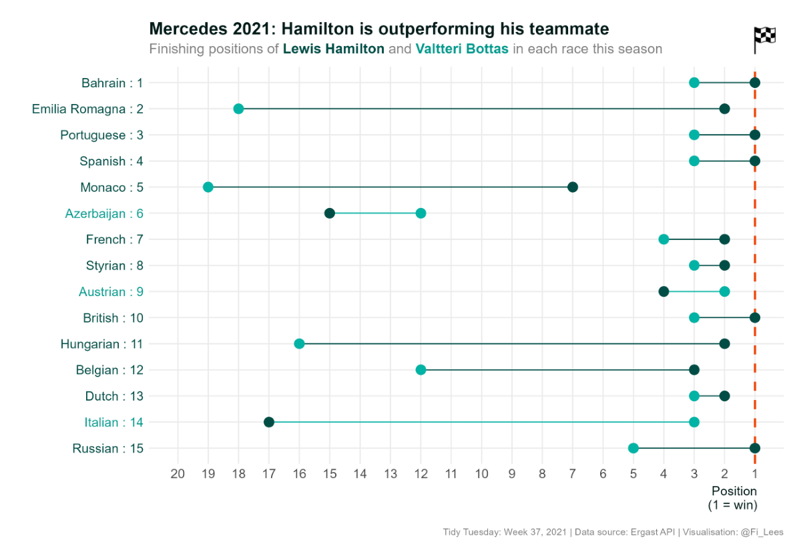

# Tidy Tuesday - A weekly social data project in R

\#TidyTuesday is a weekly data challenge that focuses on data cleaning, wrangling and visualisation using the `R` programming language. The project was founded by **Thomas Mock** in 2018 and was born out of the the [`R for Data Science` textbook](https://r4ds.had.co.nz/) and the `R4DS Online Learning Community`.

More information can be found here: https://github.com/rfordatascience/tidytuesday#readme.

My #TidyTuesday visualisations are shown below along with links to my code. There is also a README.md in each week's folder showing the development of the visualisation.

Apart from the odd dabble, I only really started using R in 2021 (I've been using SPSS and Excel for most of analytical life), but I've found the `R for Data Science` textbook and the #TidyTuesday project to be fantastic learning resources.

## 2021

### Week 40 - National Bureau of Economic Research (NBER) [(code)](https://github.com/fi-lees/tidy_tuesday/blob/master/TT_2021_W40_NBER/TT_2021_W40_NBER.R) [(readme)](https://github.com/fi-lees/tidy_tuesday/blob/master/TT_2021_W40_NBER/README.md)

------
### Week 37 - Formula One Motor Racing [(code)](https://github.com/fi-lees/tidy_tuesday/blob/master/TT_2021_W37_Formula_1/TT_2021_W37_Formula_1.R) [(readme)](https://github.com/fi-lees/tidy_tuesday/blob/master/TT_2021_W37_Formula_1/README.md)

------
