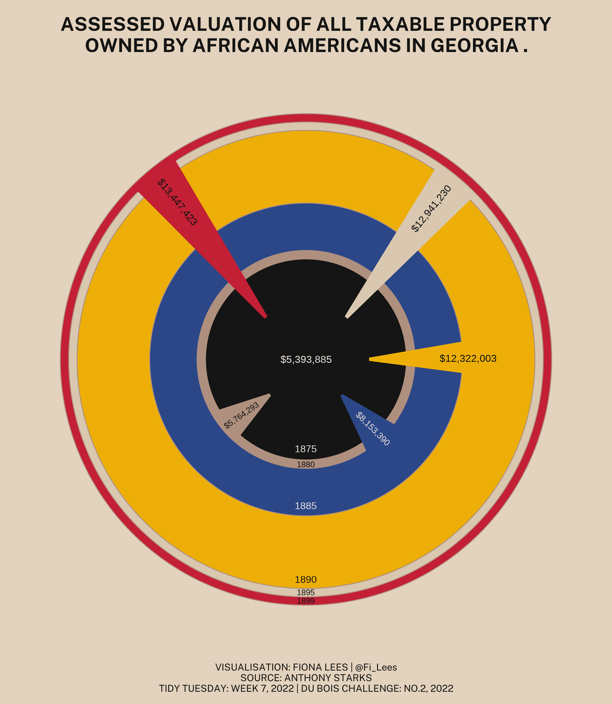
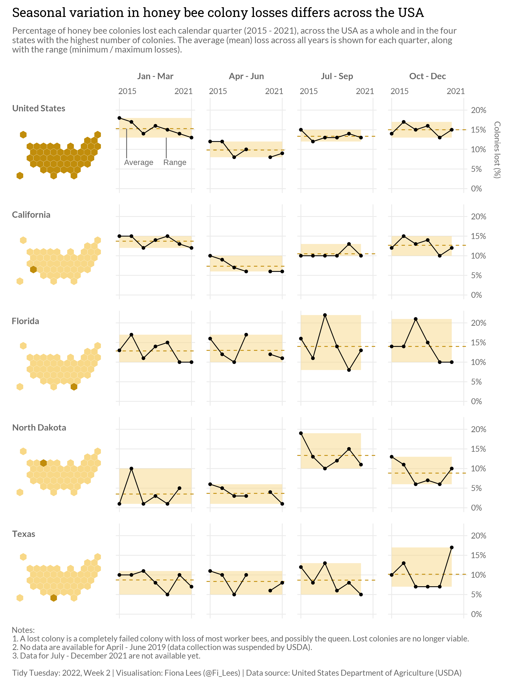
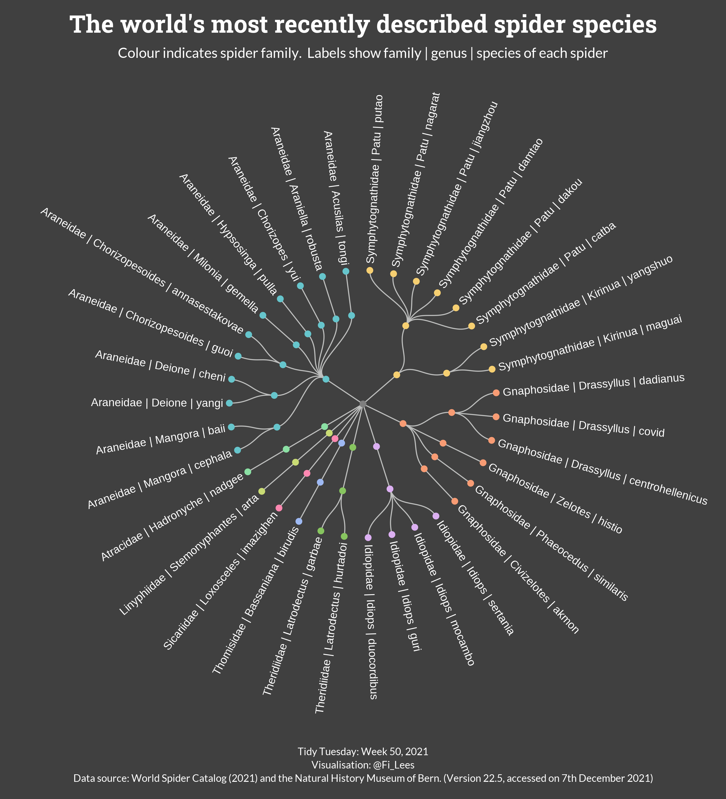
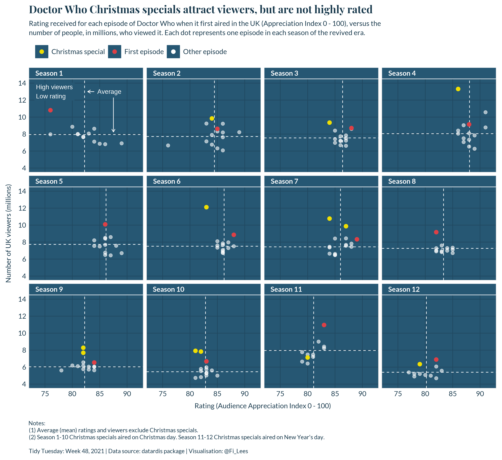
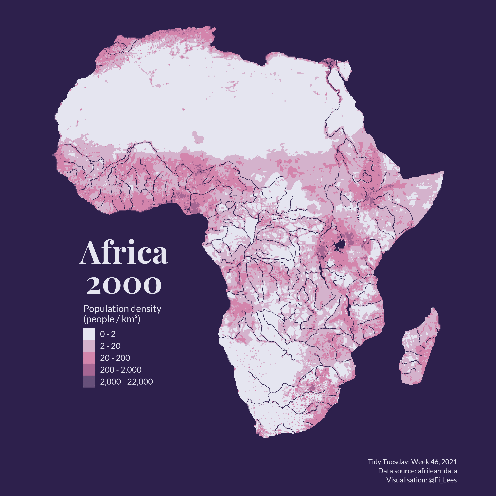
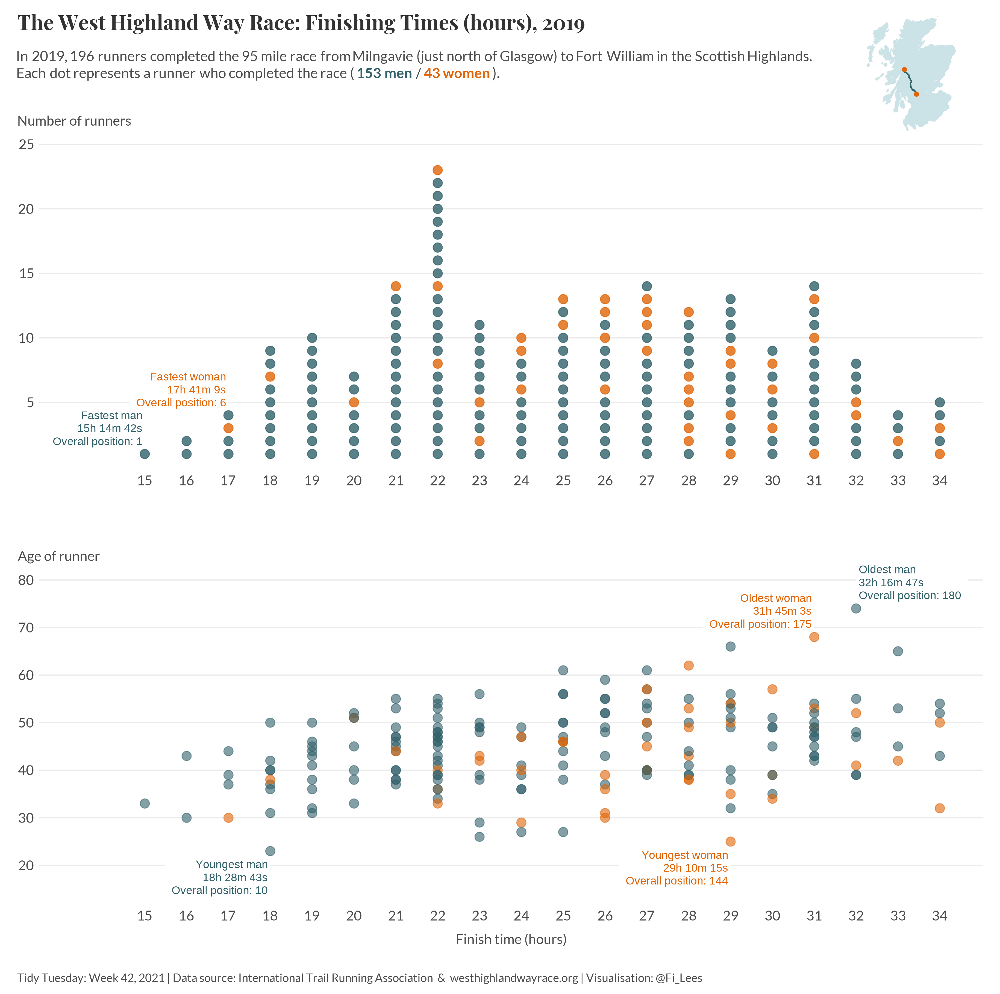
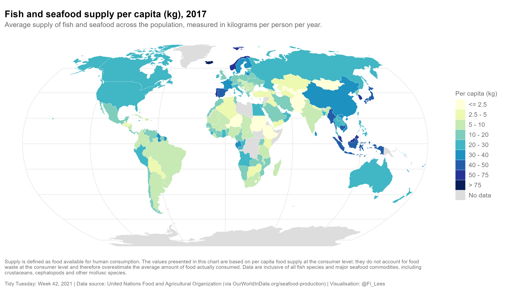
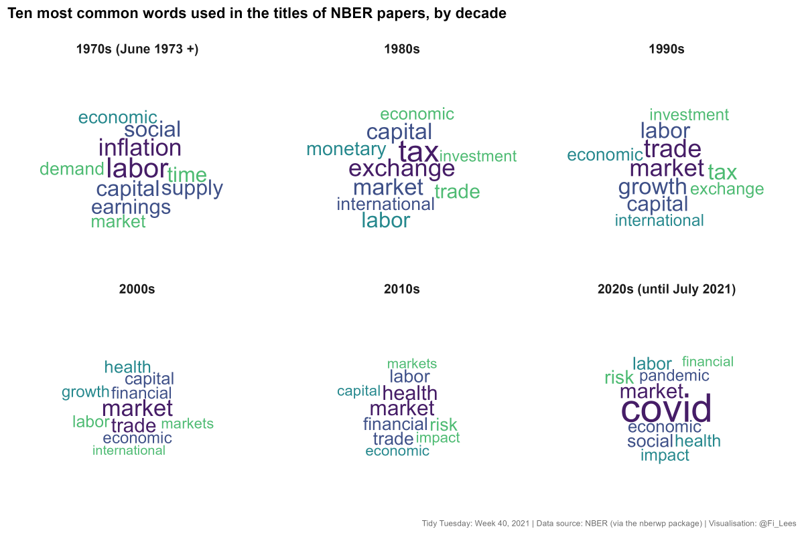
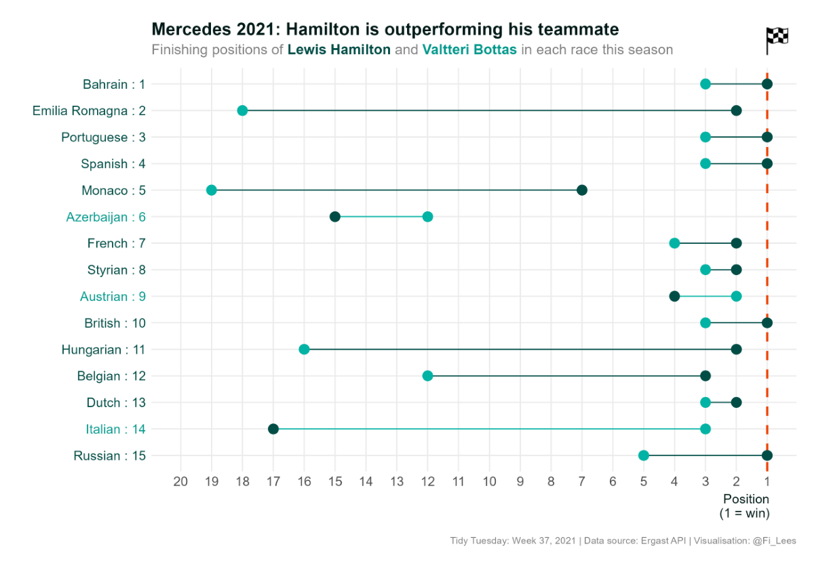

# Tidy Tuesday - A weekly social data project in R

\#TidyTuesday is a weekly data challenge that focuses on data cleaning, wrangling and visualisation using the `R` programming language. The project was founded by **Thomas Mock** in 2018 and emerged out of the [`R for Data Science` textbook](https://r4ds.had.co.nz/) and the `R4DS Online Learning Community`.

More information can be found here: https://github.com/rfordatascience/tidytuesday#readme.

My #TidyTuesday visualisations are shown below along with links to my code. There is also a README.md in each week's folder showing the development of the visualisation and my notes on how I produced it.

Apart from the odd dabble, I only really started using R in 2021 (I've been using SPSS and Excel for most of analytical life), but I've found the `R for Data Science` textbook and the #TidyTuesday project to be fantastic learning resources.

## 2022

### Week 7 - Du Bois Challenge [(code)](https://github.com/fi-lees/tidy_tuesday/blob/master/2022/TT_2022_W7_DuBoisChallenge/TT_2022_W7_DuBoisChallenge.R) [(readme)](https://github.com/fi-lees/tidy_tuesday/blob/master/2022/TT_2022_W7_DuBoisChallenge/README.md)

------

### Week 2 - Bee Colonies [(code)](https://github.com/fi-lees/tidy_tuesday/blob/master/2022/TT_2022_W2_BeeColonies/TT_2022_W2_BeeColonies.R) [(readme)](https://github.com/fi-lees/tidy_tuesday/blob/master/2022/TT_2022_W2_BeeColonies/README.md)

------

## 2021

### Week 50 - Spiders [(code)](https://github.com/fi-lees/tidy_tuesday/blob/master/2021/TT_2021_W50_Spiders/TT_2021_W50_Spiders.R) [(readme)](https://github.com/fi-lees/tidy_tuesday/blob/master/2021/TT_2021_W50_Spiders/README.md)

------
### Week 48 - Doctor Who [(code)](https://github.com/fi-lees/tidy_tuesday/blob/master/2021/TT_2021_W48_Dr_Who/TT_2021_W48_Dr_Who.R) [(readme)](https://github.com/fi-lees/tidy_tuesday/blob/master/2021/TT_2021_W48_Dr_Who/README.md)

------
### Week 46 - AfriLearnData [(code)](https://github.com/fi-lees/tidy_tuesday/blob/master/2021/TT_2021_W46_Afrilearndata/TT_2021_W46_Afrilearndata.R) [(readme)](https://github.com/fi-lees/tidy_tuesday/blob/master/2021/TT_2021_W46_Afrilearndata/README.md)

------
### Week 44 - Ultra Trail Running [(code)](https://github.com/fi-lees/tidy_tuesday/blob/master/2021/TT_2021_W44_Ultra_Trail_Running/TT_2021_W44_Ultra_Trail_Running.R) [(readme)](https://github.com/fi-lees/tidy_tuesday/blob/master/2021/TT_2021_W44_Ultra_Trail_Running/README.md)

------
### Week 42 - Global Fish and Seafood Supply [(code)](https://github.com/fi-lees/tidy_tuesday/blob/master/2021/TT_2021_W42_Global_Seafood/TT_2021_W42_Global_Seafood.R) [(readme)](https://github.com/fi-lees/tidy_tuesday/blob/master/2021/TT_2021_W42_Global_Seafood/README.md)

------
### Week 40 - National Bureau of Economic Research (NBER) [(code)](https://github.com/fi-lees/tidy_tuesday/blob/master/2021/TT_2021_W40_NBER/TT_2021_W40_NBER.R) [(readme)](https://github.com/fi-lees/tidy_tuesday/blob/master/2021/TT_2021_W40_NBER/README.md)

------
### Week 37 - Formula One Motor Racing [(code)](https://github.com/fi-lees/tidy_tuesday/blob/master/2021/TT_2021_W37_Formula_1/TT_2021_W37_Formula_1.R) [(readme)](https://github.com/fi-lees/tidy_tuesday/blob/master/2021/TT_2021_W37_Formula_1/README.md)

------
