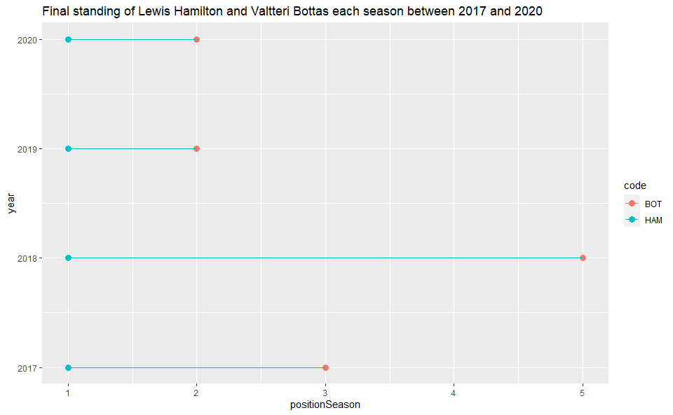
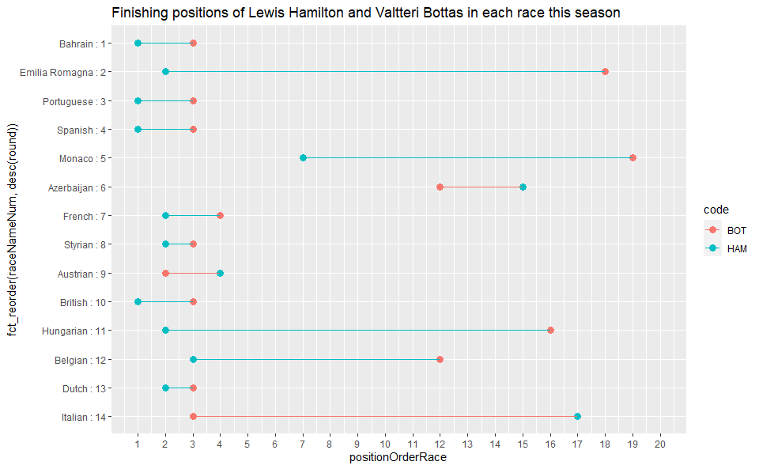
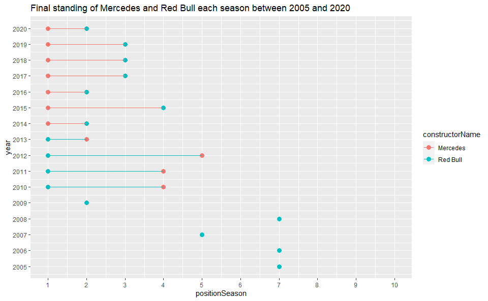
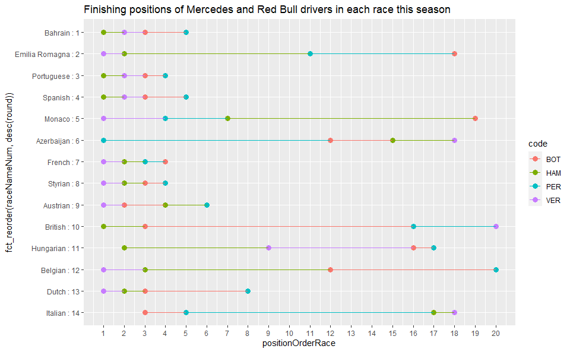
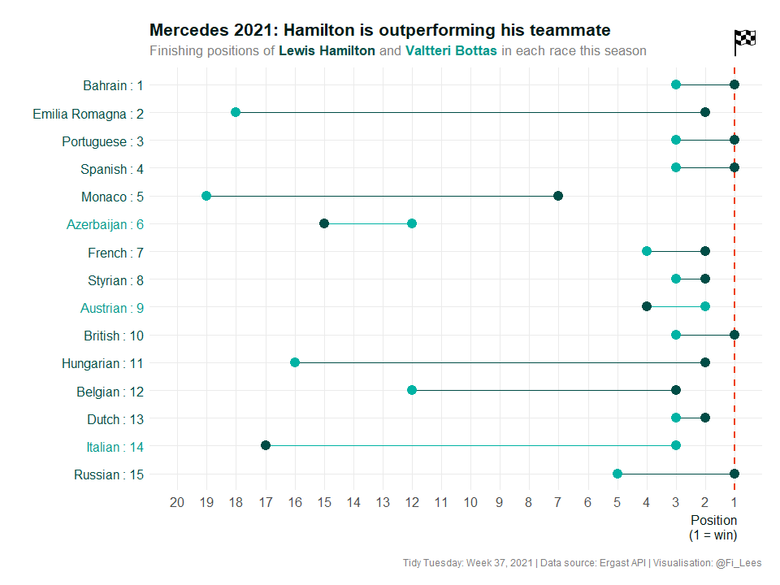
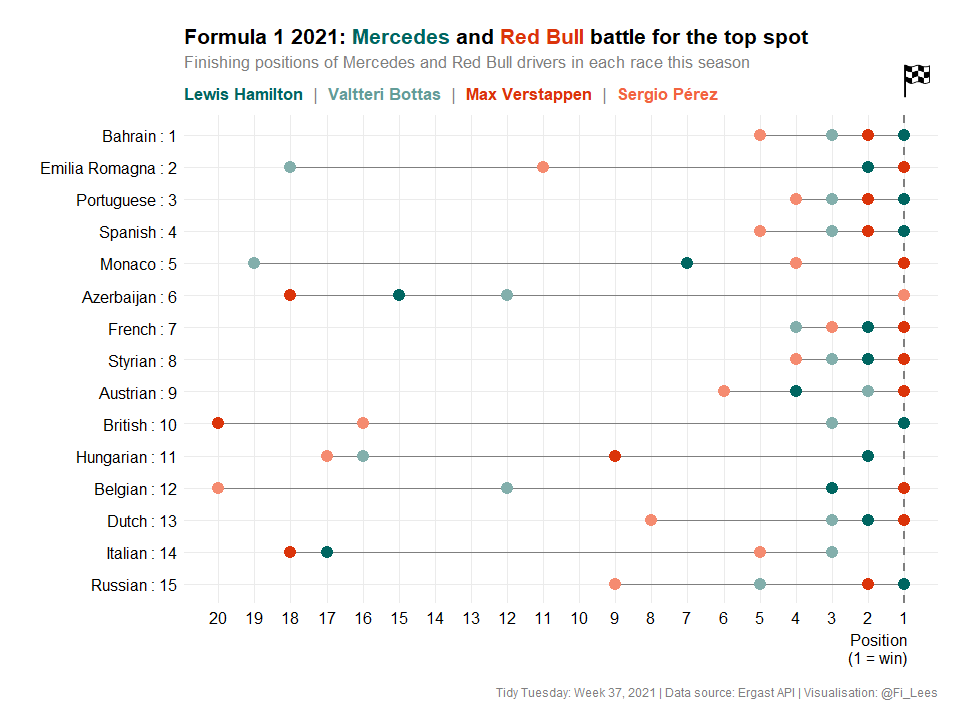

## Formula One Motor Racing
The data this week comes from the [Ergast API](https://ergast.com/mrd/db/#csv). The Ergast Developer API is an experimental web service that provides a historical record of motor racing data for non-commercial purposes. The API provides data for the Formula One series, from the beginning of the world championships in 1950 until present day.  

### Objectives
This is a massive dataset and there are so many things that could be analysed. I'm just going to focus on a few recent rivalries within and between certain teams.  

### Learning Points
This week I learned:  
- How to use Markdown. Up until now I've just been using R scripts.  
- How to read in an image (png::readPNG()) and place it in a chart (patchwork::inset_element()).  
- How to set-up my own colour palette.  
- How to colour code chart titles (ggtext::element_markdown()).

### Load Packages
Load the required packages.


```r
library(png)
library(patchwork)
library(ggtext)
library(tidyverse)
```

### Import Data
This week I'm importing the data directly from the Ergast website and storing it locally. 


```r
# Download and unzip the data
download.file("http://ergast.com/downloads/f1db_csv.zip", destfile = "data/f1db.zip")

unzip("data/f1db.zip", overwrite = TRUE, exdir = "data")
```

```r
# Pull the raw csv files into a list, removing path and file extension info
raw_data <- map(fs::dir_ls("data/", glob = "*.csv"), read_csv) %>%
  set_names(nm = (basename(names(.)) %>% tools::file_path_sans_ext()))

# What do the files look like?
raw_data %>% str(max.level = 1)

# Add the files from the list to the environment
list2env(raw_data, .GlobalEnv)
```

### Wrangle Data
Using the 'results' table as a base, pull in additional information from other tables. Drop variables I'm not interested in at the moment. I'm not necessarily going to use all of these variables, but I'd like to have a look and see what the possibilities are.


```r
# Join information about races, circuits, drivers and constructors to the results table
results_new <- results %>%
  select(resultId:constructorId, grid, positionText:laps) %>%
  left_join(select(races, -url), by = "raceId") %>%                       
  rename("raceName" = "name") %>%
  left_join(select(circuits, c(-circuitRef, -url)), by = "circuitId") %>%
  rename("circuitName" = "name") %>%
  left_join(select(drivers, c(-number, -driverRef, -url)), by = "driverId") %>%
  rename("driverNationality" = "nationality") %>%
  left_join(select(constructors, -constructorRef, -url), by = "constructorId") %>%
  rename("constructorName" = "name", "constructorNationality" = "nationality") 

# Tidy-up the race name variable and order data as desired
results_new <-  results_new %>%
  # Strip the words 'Grand Prix' out of race name.
  mutate(raceName = gsub("Grand Prix", "", raceName)) %>%
  # Create a variable that combines race name and round
  mutate(raceNameNum = str_c(raceName, ": ", as.character(round))) %>%
  select(
    resultId,
    raceId,
    year,
    round,
    raceName,
    raceNameNum,
    date:time,
    circuitId,
    circuitName:alt,
    grid:laps,
    driverId,
    code:driverNationality,
    constructorId,
    constructorName,
    constructorNationality
  ) %>%
  arrange(year, round, positionOrder)

# Add driver standing info to the table
results_new <-  results_new %>%
  left_join(driver_standings, by = c("raceId", "driverId"), suffix = c("Race", "Season")) %>%
  rename("positionOrderRace" = "positionOrder",
         "positionSeason" = "position")

#glimpse(results_new)
```

Using the 'constructor_results' table as a base, pull in additional information from other tables. Drop variables I'm not interested in at the moment.


```r
# Join information about races, circuits and constructors to the constructor results table
constructor_results_new <- constructor_results%>%
  left_join(select(races, -url), by = "raceId") %>%                       
  rename("raceName" = "name") %>%
  left_join(select(circuits, c(-circuitRef, -url)), by = "circuitId") %>%
  rename("circuitName" = "name") %>%
  left_join(select(constructors, -constructorRef, -url), by = "constructorId") %>%
  rename("constructorName" = "name", "constructorNationality" = "nationality") 

# Tidy-up the race name variable and order data as desired
constructor_results_new <-constructor_results_new %>%
  # Strip the words 'Grand Prix' out of race name.
  mutate(raceName = gsub("Grand Prix", "", raceName)) %>%
  # Create a variable that combines race name and round
  mutate(raceNameNum = str_c(raceName, ": ", as.character(round))) %>%
  select(
    constructorResultsId,
    raceId,
    year,
    round,
    raceName,
    raceNameNum,
    date:time,
    circuitId,
    circuitName:alt,
    constructorId,
    constructorName,
    constructorNationality,
    points:status
  ) %>% 
  arrange(year, round, points)

# Add constructor standing info to the table
constructor_results_new <-  constructor_results_new %>%
  left_join(constructor_standings, by = c("raceId", "constructorId"), suffix = c("Race", "Season")) %>%
  select (-positionText) %>% 
  rename("positionSeason" = "position")

#glimpse(constructor_results_new)
```

### Explore Data
I'm interested in rivalries within and between teams. I'm going to focus on:  
- Mercedes: Lewis Hamilton vs. Valtteri Bottas  
- Mercedes vs. Red Bull  


#### Mercedes: Lewis Hamilton vs. Valtteri Bottas  
**Q:** In which years did Hamilton and/or Bottas drive for Mercedes? Did they drive in the same number of races?  
**A:** Hamilton has driven for Mercedes since 2013. Bottas joined the team in 2017. Since 2017, they have driven in the same number of races each season, except for 2020 when Hamilton missed a race (self-isolating due to covid).


```r
results_new %>% 
  filter(code %in% c("BOT", "HAM"), constructorName == "Mercedes") %>% 
  group_by(year, code) %>% 
  summarise(n_races = n()) %>% 
  pivot_wider(names_from = code, values_from = n_races) %>% 
  ungroup()
```

```
## # A tibble: 9 x 3
##    year   HAM   BOT
##   <dbl> <int> <int>
## 1  2013    19    NA
## 2  2014    19    NA
## 3  2015    19    NA
## 4  2016    21    NA
## 5  2017    20    20
## 6  2018    21    21
## 7  2019    21    21
## 8  2020    16    17
## 9  2021    14    14
```

  
**Q:** Where did Hamilton and Bottas stand overall at the end of each season between 2017 and 2020?  
**A:** Hamilton finished first every year. Bottas was third in 2017, fifth in 2018, but finished second in 2019 and 2020.


```r
results_new %>%
  filter(between(year, 2017, 2020), constructorName == "Mercedes") %>%
  group_by(year) %>% 
  filter(round == max(round)) %>% 
  ungroup() %>% 
  ggplot(aes(x = positionSeason, y = year, colour = code)) +
  geom_point(size = 3) +
  geom_line(aes(group = year)) +
  labs(title = "Final standing of Lewis Hamilton and Valtteri Bottas each season between 2017 and 2020")
```



  
**Q:** Where did Hamilton and Bottas finish in each race this season (2021)?  
**A:** Bottas has only finished ahead of Hamilton three times so far this season (races 6, 9 and 14). 


```r
results_new %>%
  filter(year == 2021, constructorName == "Mercedes") %>%
  ggplot(aes(x = positionOrderRace, y = fct_reorder(raceNameNum, desc(round)), colour = code)) +
  geom_point(size = 3) +
  geom_line(aes(group = round)) +
  scale_x_continuous(limits = c(1, 20), breaks = seq(1, 20, 1)) +
  labs(title = "Finishing positions of Lewis Hamilton and Valtteri Bottas in each race this season")
```



  
#### Mercedes vs. Red Bull
**Q:** When did Mercedes and Red Bull first start in F1?  
**A:** Mercedes 1954, Red Bull 2005. However, if you look at the number of races that each constructor took part in each season, you can see that Mercedes didn't enter any races after 1955 until 2010.


```r
results_new %>% 
  filter(constructorName %in% c("Mercedes", "Red Bull")) %>% 
  group_by(constructorName) %>% 
  summarise(first_year = min(year), last_year = max(year)) %>% 
  ungroup()
```

```
## # A tibble: 2 x 3
##   constructorName first_year last_year
##   <chr>                <dbl>     <dbl>
## 1 Mercedes              1954      2021
## 2 Red Bull              2005      2021
```

```r
results_new %>% 
  filter(constructorName %in% c("Mercedes", "Red Bull")) %>% 
  group_by(year, constructorName) %>% 
  summarise(n_races = n()) %>% 
  pivot_wider(names_from = constructorName, values_from = n_races) %>% 
  ungroup()
```

```
## # A tibble: 19 x 3
##     year Mercedes `Red Bull`
##    <dbl>    <int>      <int>
##  1  1954       18         NA
##  2  1955       24         NA
##  3  2005       NA         38
##  4  2006       NA         36
##  5  2007       NA         34
##  6  2008       NA         36
##  7  2009       NA         34
##  8  2010       38         38
##  9  2011       38         38
## 10  2012       40         40
## 11  2013       38         38
## 12  2014       38         38
## 13  2015       38         38
## 14  2016       42         42
## 15  2017       40         40
## 16  2018       42         42
## 17  2019       42         42
## 18  2020       34         34
## 19  2021       28         28
```

  
**Q:** Where did Mercedes and Red Bull stand overall at the end of each season between 2005 and 2020? (Mercedes will only have a final standing from 2010 onwards, but I want to see how Red Bull were doing before Mercedes joined in 2010).    
**A:** Red Bull were the winning constructor every year between 2010 and 2013 (four wins). However, since 2014 Mercedes have dominated and have come top every season (7 wins).


```r
constructor_results_new %>%
  filter(between(year, 2005, 2020), constructorName %in% c("Mercedes", "Red Bull")) %>%
  group_by(year) %>% 
  filter(round == max(round)) %>% 
  ungroup() %>% 
  ggplot(aes(x = positionSeason, y = year, colour = constructorName)) +
  geom_point(size = 3) +
  geom_line(aes(group = year)) +
  scale_x_continuous(limits = c(1, 10), breaks = seq(1, 10, 1)) +
  scale_y_continuous(limits = c(2005, 2020), breaks = seq(2005, 2020, 1)) +
  labs(title = "Final standing of Mercedes and Red Bull each season between 2005 and 2020")
```



  
**Q:** Where did the Mercedes and Red Bull drivers finish in each race this season (2021)?  
**A:** Red Bull have finished first in eight races (Verstappen 7 wins, Pérez 1 win). Mercedes have finished first four times (Hamilton 4 wins, Bottas 0 wins). There have only been two races this season where either a Mercedes or Red Bull driver did not win.  


```r
results_new %>%
  filter(year == 2021, constructorName %in% c("Mercedes", "Red Bull")) %>%
  ggplot(aes(x = positionOrderRace, y = fct_reorder(raceNameNum, desc(round)), colour = code)) +
  geom_point(size = 3) +
  geom_line(aes(group = round)) +
  scale_x_continuous(limits = c(1, 20), breaks = seq(1, 20, 1)) +
  labs(title = "Finishing positions of Mercedes and Red Bull drivers in each race this season")
```



  
### Visualise Data
I'm going to produce two visualisations:  
1. A more polished version of the 2021 Hamilton vs. Bottas chart, showing the outcome of each race this season.  
2. A more polished version of the 2021 Mercedes vs. Red Bull chart, showing the outcome of each race this season.  

  
First, import a public domain image of a checkered flag to use in the visualisations. Sourced from [the Noun Project](https://thenounproject.com/).


```r
check_flag_image <- readPNG(
  "noun_check_flag.png", 
  native = TRUE, 
  info = TRUE)
```

Next, define a colour palette for drivers and teams.


```r
# Mercedes only chart
driver_colours_1 = c("HAM" = "#004d49", "BOT" = "#00ccc2")
# Tweak the drivers colour slightly when using for labels (make darker to give better contrast against white background)
ham_lab_colour = "#004d49"
bot_lab_colour = "#00b3aa"
Other_lab_colour = "#7e7d82"

# Mercedes vs. Red Bull chart
driver_colours_2 = c("HAM" = "#006661", "BOT" = "#83afac", "VER" = "#db340a", "PER" = "#f37859")
```

  
#### Mercedes: Lewis Hamilton vs. Valtteri Bottas 2021

Set the colour for the y-axis labels to match the driver who finished ahead in each race.


```r
label_colours <- results_new %>%
  filter(year == 2021, constructorName == "Mercedes") %>%
  group_by(round) %>%
  mutate(driver_rank = rank(positionOrderRace)) %>%
  filter(driver_rank == 1) %>%
  mutate(lab_colour = ifelse(code == "BOT", bot_lab_colour, ham_lab_colour)) %>%
  select(round, lab_colour) %>%
  arrange(desc(round)) %>%
  ungroup()
```

Build the visualisation:


```r
Mercedes_2021 <- results_new %>%
  filter(year == 2021, constructorName == "Mercedes") %>%
  ggplot(aes(
    x = positionOrderRace,
    y = fct_reorder(raceNameNum, desc(round)),
    colour = code
  )) +
  # Add a 'finishing line'
  geom_vline(
    xintercept = 1,
    linetype = "dashed",
    colour = "#db340a", #dark orange
    size = 1
  ) +
  geom_line(aes(group = raceNameNum), colour = Other_lab_colour) +
  geom_point(size = 3.5) +
  scale_colour_manual(values = driver_colours_1) +
  # Reverse the finishing position scale so that the driver with the best 
  # finishing position looks like they are in the lead.
  scale_x_reverse(limits = c(20, 1), breaks = seq(1, 20, 1)) +
  theme_minimal() +
  theme(
    legend.position = "none",
    plot.title = element_markdown(
      size = 18,
      colour = ham_lab_colour,
      face = "bold",
      margin = margin(t = 5, r = 0, b = 5, l = 0)
    ),
    plot.subtitle = element_markdown(
      size = 14,
      colour = Other_lab_colour,
      margin = margin(t = 0, r = 0, b = 10, l = 0)
    ),
    plot.caption = element_markdown(
      colour = Other_lab_colour
      ),
    # colour code the y-axis label to match the driver who finished first
    axis.text.y = element_text (size = 12, colour = label_colours$lab_colour),
    axis.text.x = element_text (size = 12, colour = Other_lab_colour),
    axis.title.x = element_text(
      size = 12,
      colour = ham_lab_colour,
      hjust = 0.955,
      margin = margin(t = 5, r = 0, b = 10, l = 0)
    ),
    panel.grid.minor = element_blank(),
    plot.margin = margin(rep(8, 4)),
  ) +
  labs(
    title = "Mercedes 2021: Hamilton is outperforming his teammate",
    subtitle = "Finishing positions of
       <b style='color:#004d49'>Lewis Hamilton</b>
       and
       <b style='color:#00b3aa'>Valtteri Bottas</b> in each race this season",
    x = "Position\n(1 = win)",
    y = "",
    caption = "Tidy Tuesday: Week 37, 2021 | Data source: Ergast API | Visualisation: @Fi_Lees"
  ) +
  # Add the checkered flag image to sit above the 'finishing line'
  patchwork::inset_element(
    p = check_flag_image,
    l = 0.939,
    b = 0.89,
    r = 0.99,
    t = 0.97,
    align_to = "full"
  )

Mercedes_2021
```



Save this visualisation:


```r
ggsave("Mercedes_2021.png", Mercedes_2021, width = 12, height = 8, units = "in")
```

**Alt text for Mercedes_2021.png:**
Connected dot plot (also known as a dumbbell plot), showing the finishing positions of Formula 1 Mercedes drivers Lewis Hamilton and Valtteri Bottas in each race this season (2021). Hamilton has won four out fourteen races in the 2021 season. Bottas hasn't won any yet, but has finished ahead of Hamilton in three races. The 2021 season hasn't finished yet. Data sourced from Ergast API (https://ergast.com/mrd/db/#csv).

  
#### Mercedes vs. Red Bull 2021

I built a similar visualisation for all four Mercedes and Red Bull drivers. I've toned it down a bit, but maybe it's still too much with four drivers? 


```r
Mercedes_Redbull_2021 <- results_new %>%
  filter(year == 2021, constructorName %in% c("Mercedes", "Red Bull")) %>%
  ggplot(aes(
    x = positionOrderRace,
    y = fct_reorder(raceNameNum, desc(round)),
    colour = code
  )) +
  geom_vline(
    xintercept = 1,
    linetype = "dashed",
    colour = Other_lab_colour,
    size = 1
  ) +
  geom_line(aes(group = raceNameNum), colour = Other_lab_colour) +
  geom_point(size = 4) +
  scale_colour_manual(values = driver_colours_2) +
  scale_x_reverse(limits = c(20, 1), breaks = seq(1, 20, 1)) +
  theme_minimal() +
  theme(
    legend.position = "none",
    plot.title = element_markdown(
      size = 16,
      colour = "black",
      face = "bold",
      margin = margin(t = 5, r = 0, b = 5, l = 0)
    ),
    plot.subtitle = element_markdown(
      size = 12,
      colour = Other_lab_colour,
      margin = margin(t = 0, r = 0, b = 10, l = 0)
    ),
    plot.caption = element_text(colour = Other_lab_colour),
    axis.text.y = element_text (size = 12, colour = "black"),
    axis.text.x = element_text (size = 12, colour = "black"),
    axis.title.x = element_text(
      size = 12,
      colour = "black",
      hjust = 0.955,
      margin = margin(t = 5, r = 0, b = 10, l = 0)
    ),
    panel.grid.minor = element_blank(),
    plot.margin = margin(rep(8, 4)),
  ) +
  labs(
    title = "Formula 1 2021: <b style='color:#006661'>Mercedes</b> and <b style='color:#db340a'>Red Bull</b> battle for the top spot",
    subtitle = "Finishing positions of Mercedes and Red Bull  drivers in each race this season<br><br> 
       <b style='color:#006661'> Lewis Hamilton </b> | <b style='color:#83afac'> Valtteri Bottas </b> |
       <b style='color:#db340a'> Max Verstappen </b> | <b style='color:#f37859'> Sergio Pérez </b>",
    x = "Position\n(1 = win)",
    y = "",
    caption = "Tidy Tuesday: Week 37, 2021 | Data source: Ergast API | Visualisation: @Fi_Lees"
  ) +
  patchwork::inset_element(
    p = check_flag_image,
    l = 0.939,
    b = 0.85,
    r = 0.99,
    t = 0.95,
    align_to = "full"
  )

Mercedes_Redbull_2021
```


Save this visualisation:


```r
ggsave("Mercedes_Redbull_2021.png", Mercedes_Redbull_2021, width = 12, height = 8, units = "in")
```

**Alt text for Mercedes_2021.png:**
Connected dot plot (also known as a dumbbell plot), showing the finishing positions of Formula 1 Mercedes and Red Bull drivers in each race this season (2021). Red Bull have finished first in eight races (Verstappen 7 wins, Pérez 1 win). Mercedes have finished first four times (Hamilton 4 wins, Bottas 0 wins). There have only been two races this season where a Mercedes or Red Bull driver did not win. The 2021 season hasn't finished yet. Data sourced from Ergast API (https://ergast.com/mrd/db/#csv).


