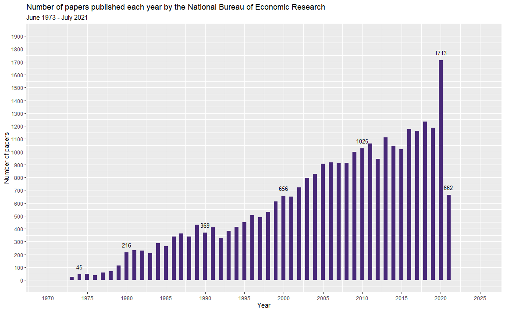

## National Bureau of Economic Research
This week's data comes from the [National Bureau of Economic Research (NBER)](https://www.nber.org) and is provided via the [`nberwp` package by Ben Davies](https://github.com/bldavies/nberwp). The package contains data about NBER working papers published between June 1973 and July 2021. Information is provided about the papers, authorship and associated work programs.
  
### Objectives
I'm going to focus on the `papers` data frame. Each row describes a unique working paper (paper id, title, year / month of publication). I'm going to investigate which words are used most frequently in paper titles and whether this varies across the decades.
  
### Learning Points
This week I learned:  
- How to use the `tidytext` package to carry out some simple text mining. I used `unnest_tokens()` to split each title into individual words. [Text Mining with R](https://www.tidytextmining.com/index.html), by Julia Silge and David Robinson is a great introduction to text mining.  
- How to create word clouds using the `ggwordcloud` package. Not usually my data vis of choice, but it's good to know how to create them in R.
  
### Load Packages
Load the required packages.  


```r
library(ggwordcloud)
library(tidytext)
library(tidyverse)
```
  
### Import Data
Read in the `papers` data.


```r
papers <- readr::read_csv(
  "https://raw.githubusercontent.com/rfordatascience/tidytuesday/master/data/2021/2021-09-28/papers.csv"
  )
```
  
### Explore Data
#### Summary
Run a quick summary on `papers` to get an idea of what we have.  


```r
papers_new <- papers %>% 
  # Add a variable showing the decade of publication
  mutate(decade = factor(str_c(as.character(floor(year / 10) * 10),"s")), .before = year) %>% 
  # Use the first letter of each paper id to group papers into a catalogue series
  mutate(
    catalogue_series = str_sub(paper, 1, 1),
    catalogue_series = factor(case_when(
      catalogue_series == "h" ~ "Historical",
      catalogue_series == "t" ~ "Technical",
      catalogue_series == "w" ~ "General"
      )),
    .after = paper
  )

#skimr::skim(papers_new) # Sometimes I like to use skimr to summarise data 
summary(papers_new)
```

```
##     paper             catalogue_series   decade           year     
##  Length:29434       General   :28961   1970s:  396   Min.   :1973  
##  Class :character   Historical:  136   1980s: 2908   1st Qu.:1999  
##  Mode  :character   Technical :  337   1990s: 4489   Median :2008  
##                                        2000s: 8296   Mean   :2006  
##                                        2010s:10970   3rd Qu.:2015  
##                                        2020s: 2375   Max.   :2021  
##      month           title          
##  Min.   : 1.000   Length:29434      
##  1st Qu.: 4.000   Class :character  
##  Median : 7.000   Mode  :character  
##  Mean   : 6.534                     
##  3rd Qu.: 9.000                     
##  Max.   :12.000
```
    
     
#### How many papers?
**Q:** How many papers were published each year?  
**A:** The number of papers increased from 45 in 1974 to 1,713 in 2020.   


```r
# Paper counts for key years, to be used for labelling in the chart below
paper_counts_year <- papers_new %>% 
  count(year) %>% 
  rename(n_papers = n) %>% 
  filter(year %in% c(1974, 1980, 1990, 2000, 2010, 2020, 2021))

# Create a chart showing the number of papers published each year
papers_new %>% 
  ggplot(aes(x = year)) +
  geom_bar(fill = "#482878FF", width = 0.5) +
  geom_text(data = paper_counts_year, aes(y = n_papers, label = n_papers), nudge_y = 60, size = 3.5) +
  scale_x_continuous(limits = c(1970, 2025), breaks = seq(1970, 2025, 5)) +
  scale_y_continuous(limits = c(0, 1900), breaks = seq(0, 1900, 100)) +
  labs(title = "Number of papers published each year by the National Bureau of Economic Research",
       subtitle = "June 1973 - July 2021",
       x = "Year",
       y = "Number of papers")
```



  
#### How many title words?
**Q:** How many words / unique words were used in paper titles?   
**A:** After removing standard [stop words](https://en.wikipedia.org/wiki/Stop_word), numbers and words repeated in a single title: **words** = 175,096; **unique words** = 12,032 
  

```r
# Split each paper title into individual words 
title_words <- papers_new %>%
  # Split title and format so that each word is on a separate row
  unnest_tokens(word, title, drop = FALSE) %>% 
  # Remove standard stop words (e.g. and, the, to, of)
  anti_join(stop_words) %>% 
  # Remove numbers (e.g. 1982, 19)
  filter(nchar(gsub('[a-z.]', '', word)) == 0) %>%
  # Remove duplicate words (those that appear in a title more than once)
  group_by(paper, word) %>% 
  mutate(word_instance = row_number()) %>% 
  filter(word_instance == 1) %>% 
  ungroup() %>%
  select(-catalogue_series, -month, -word_instance)

# How many words?
length(title_words$word)
```

```
## [1] 175096
```

```r
# How many unique words?
n_distinct(title_words$word)
```

```
## [1] 12032
```

  
#### Most common title words
**Q:** What were the most common words used in paper titles across all years?   
**A:** (see list below). 


```r
# Most common words?
title_words %>% 
  count(word, sort = TRUE) %>%
  rename(word_freq = n) %>% 
  print(n = 20)
```

```
## # A tibble: 12,032 x 2
##    word          word_freq
##    <chr>             <int>
##  1 evidence           3170
##  2 policy             1531
##  3 market             1517
##  4 effects            1426
##  5 trade              1152
##  6 labor              1077
##  7 capital            1072
##  8 economic           1049
##  9 health             1018
## 10 u.s                1008
## 11 financial           989
## 12 growth              912
## 13 markets             851
## 14 international       835
## 15 tax                 828
## 16 risk                812
## 17 monetary            753
## 18 exchange            729
## 19 social              726
## 20 income              712
## # ... with 12,012 more rows
```
  
  
#### Analysis specific stop words
There are some common words, in addition to classic stop words, that don't tell us much about the subject of a paper. For example, the word 'evidence' appears in a title around twice as often as any other word. I've created a list of these words and have chosen to filter them out for the rest of this analysis. It was quite hard to decide which words to add to this list and which to leave out - subjective decision making. I swithered over the words 'market' and 'markets', but I've left them in the analysis for the moment.


```r
# Define stop words specific to this analysis
other_stopwords <- c(
  "analysis",
  "effect",
  "effects",
  "estimation",
  "evidence",
  "model",
  "models",
  "policy",
  "rate",
  "rates",
  "theory",
  "u.s"
)

# Remove other stop words specific to this analysis
title_words_reduced <- title_words %>% 
  filter(!word %in% other_stopwords) 

# How many words now?
length(title_words_reduced$word)
```

```
## [1] 163452
```

```r
# How many unique words now?
n_distinct(title_words_reduced$word)
```

```
## [1] 12020
```

  
#### Most common words, by decade
**Q:** What were the most common title words used in each decade?   
**A:** See summary below.


```r
#  Create summary table showing frequency of word use in each decade.
summary_by_decade <- title_words_reduced %>% 
  group_by(decade) %>% 
  mutate(n_papers = n_distinct(paper)) %>% 
  group_by(decade, word) %>% 
  summarise(
    n_papers = min(n_papers), 
    word_freq_n = n(),
    word_freq_pct = (word_freq_n / n_papers) 
    ) %>% 
  mutate(decade_rank = dense_rank(desc(word_freq_n))) %>% 
  arrange(decade, decade_rank) %>% 
  ungroup()

# Show the top three words for each decade.
# Note that some words were used the same number of times and rank jointly with other words.
summary_by_decade %>% 
  filter(decade_rank <= 3) %>% 
  print(n = 20)
```

```
## # A tibble: 19 x 6
##    decade word      n_papers word_freq_n word_freq_pct decade_rank
##    <fct>  <chr>        <int>       <int>         <dbl>       <int>
##  1 1970s  labor          396          25        0.0631           1
##  2 1970s  inflation      396          24        0.0606           2
##  3 1970s  capital        396          20        0.0505           3
##  4 1970s  earnings       396          20        0.0505           3
##  5 1980s  exchange      2908         194        0.0667           1
##  6 1980s  tax           2908         175        0.0602           2
##  7 1980s  market        2908         156        0.0536           3
##  8 1990s  market        4489         262        0.0584           1
##  9 1990s  trade         4489         254        0.0566           2
## 10 1990s  growth        4489         242        0.0539           3
## 11 2000s  market        8295         449        0.0541           1
## 12 2000s  trade         8295         333        0.0401           2
## 13 2000s  financial     8295         298        0.0359           3
## 14 2010s  market       10967         524        0.0478           1
## 15 2010s  health       10967         491        0.0448           2
## 16 2010s  financial    10967         432        0.0394           3
## 17 2020s  covid         2374         242        0.102            1
## 18 2020s  market        2374         111        0.0468           2
## 19 2020s  economic      2374          92        0.0388           3
```


### Visualise Data
I'm going to explore different ways of visualising the top ten ranked words for each decade.
   
First, set the theme for the visualisations.


```r
theme_set(theme_minimal())

theme_update(text = element_text(colour = "grey40"),
             plot.title = element_text(colour = "black", size = 16, face = "bold", margin = margin(t = 5, b = 5)),
             plot.subtitle = element_text(size = 12, margin = margin(b = 10)),
             strip.text.x = element_text(size = 12, vjust = 1),
             axis.text = element_text(size = 11),
             axis.title.x = element_text(margin = margin(t = 10, b = 10), hjust = 0.0),
             panel.grid.major.y = element_blank(),
             panel.grid.minor = element_blank(),
             plot.margin = margin(rep(8, 4)),
             legend.position = "none"
             )
```

   
#### Chart 1: Ten most common title words, by decade (number of times used)
A helpful first draft, but this chart doesn't account for the increasing number of papers published each decade. The bars are also quite 'heavy'. Note that some words were used the same number of times and rank jointly with other words, so there may be more than ten words listed for each decade. I could have used `slice_head()`rather than `filter()` to keep to ten words, but I chose not to. 


```r
# Create new labels for the facet strips
decade_labels <- c("1970s" = "1970s\n(June 1973 +)", 
                   "1980s" = "1980s", 
                   "1990s" = "1990s", 
                   "2000s" = "2000s", 
                   "2010s" = "2010s", 
                   "2020s" =  "2020s\n(until July 2021)")

# Create chart
chart_1 <- summary_by_decade %>% 
  filter(decade_rank <= 10) %>% 
  # Reorder the words by frequency within each decade so that they are shown in order
  mutate(word = reorder_within(word, word_freq_n, decade)) %>% 
  ggplot(aes(x = word_freq_n, y = word)) +
  geom_col(fill = "#482878FF", width = 0.5) +
  scale_y_reordered() +
  facet_wrap(~ decade, scales = "free_y", ncol = 3, labeller = labeller(decade = decade_labels)) +
  labs(title = "Ten most common words used in the titles of NBER papers, by decade",
       subtitle = "Some words rank equally, therefore there may be more than ten words listed for each decade",
       x = "Number of times word was used in a title",
       y = "",
       caption = "Tidy Tuesday: Week 40, 2021 | Data source: NBER (via the nberwp package) | Visualisation: @Fi_Lees")

chart_1
```


   
#### Chart 2: Ten most common title words, by decade (percentage of times used)
This chart accounts for the increasing number of papers each decade by showing the percentage of titles in which a word was used. I've changed it to a lollipop chart to make it less 'heavy'. I've also colour coded the points according to rank (1-10) just to see how this looks.


```r
chart_2 <- summary_by_decade %>% 
  filter(decade_rank <= 10) %>% 
  mutate(word = reorder_within(word, word_freq_pct, decade)) %>% 
  ggplot() +
  # Lollipop stick
  geom_segment(aes(x = 0, xend = word_freq_pct, y = word, yend = word), colour = "grey") +
  # Lollipop head
  geom_point(aes(x = word_freq_pct, y = word, colour = decade_rank), size = 3.5) +
  scale_colour_viridis_b(direction = 1, option = "D", end = 0.8) +
  scale_y_reordered() +
  scale_x_continuous(
    labels = scales::percent_format(accuracy = 1),
    limits = c(0, 0.12), 
    breaks = seq(0, 0.12, 0.02)
    ) +
  facet_wrap(~ decade, scales = "free_y", ncol = 3, labeller = labeller(decade = decade_labels)) +
  labs(title = "Ten most common words used in the titles of NBER papers, by decade",
       subtitle = "Some words rank equally, therefore there may be more than ten words listed for each decade",
       x = "Percentage of titles in which word was used",
       y = "",
       caption = "Tidy Tuesday: Week 40, 2021 | Data source: NBER (via the nberwp package) | Visualisation: @Fi_Lees")

chart_2
```


   
#### Chart 3: Ten most common title words, by decade (word cloud)
This shows the same information as Chart 2, but in the form of a word cloud. Word clouds don't provide precise information, but they can give you a quick idea of word frequency. Can be useful when precision isn't the goal.  

There are various parameters that can be tweaked to change the look of a word cloud; this [`ggwordcloud` vignette](https://cran.r-project.org/web/packages/ggwordcloud/vignettes/ggwordcloud.html) gives a really helpful overview.


```r
# Create different labels for the facet strips (no line breaks this time)
decade_labels_2 <- c("1970s" = "1970s (June 1973 +)", 
                     "1980s" = "1980s", 
                     "1990s" = "1990s", 
                     "2000s" = "2000s", 
                     "2010s" = "2010s", 
                     "2020s" =  "2020s (until July 2021)")

# Create word cloud
set.seed(42)
chart_3 <- summary_by_decade %>% 
  filter(decade_rank <= 10) %>%
  ggplot(aes(label = word, size = word_freq_pct, colour = decade_rank)) +
  # Draw word cloud and set eccentricity of the spiral
  geom_text_wordcloud_area(eccentricity = 1) +
  # Set size of word cloud text area
  scale_size_area(max_size = 15) +
  scale_colour_viridis_b(direction = 1, option = "D", end = 0.8) +
  facet_wrap(~ decade, ncol = 3, labeller = labeller(decade = decade_labels_2)) +
  theme(plot.subtitle = element_text(margin = margin(b = 20)),
        strip.text.x = element_text(size = 14, face = "bold", vjust = 1)) +
  labs(title = "Ten most common words used in the titles of NBER papers, by decade",
       subtitle = "Some words rank equally, therefore there may be more than ten words listed for each decade",
       caption = "Tidy Tuesday: Week 40, 2021 | Data source: NBER (via the nberwp package) | Visualisation: @Fi_Lees")

chart_3
```


Save this visualisation:


```r
ggsave("wordcloud.png", chart_3 , width = 12, height = 8, units = "in", dpi = 300)
```

   
#### Chart 4: Ten most common title words, by decade (first time in top ten)
Similar to Chart 2, but highlighting new entries to the top ten each decade. Many top ten words are the same in each decade. For the 2020s we need to remember we're only a year-and-a-half into this decade; the top ten word list for the 2020s might look very different by 2029.


```r
# Flag words that are a new entry to the top ten (never appeared in any previous decade)
top_ten_decade <- summary_by_decade %>% 
  filter(decade_rank <= 10) %>% 
  group_by(word) %>% 
  mutate(word_instance = row_number(),
         new_entry = factor(ifelse(word_instance == 1, "Yes", "No")),
         new_entry = factor(new_entry, levels = c("Yes", "No"))
         ) %>% 
  ungroup()

chart_4 <- top_ten_decade %>% 
  mutate(word = reorder_within(word, word_freq_pct, decade)) %>% 
  ggplot() +
  geom_segment(aes(x = 0, xend = word_freq_pct, y = word, yend = word), colour = "grey") +
  geom_point(aes(x = word_freq_pct, y = word, colour = new_entry), size = 3) +
  scale_colour_manual(values = c("#482878FF", "grey")) +
  scale_y_reordered() +
  scale_x_continuous(
    labels = scales::percent_format(accuracy = 1),
    limits = c(0, 0.12), 
    breaks = seq(0, 0.12, 0.02)
    ) +
  facet_wrap(~ decade, scales = "free_y", ncol = 3, labeller = labeller(decade = decade_labels)) +
  theme(
    legend.position = "top", 
    legend.justification = "left", 
    legend.title=element_text(size = 12),
    legend.text=element_text(size = 12)) +
  labs(title = "Ten most common words used in the titles of NBER papers, by decade",
       subtitle = "Some words rank equally, therefore there may be more than ten words listed for each decade",
       x = "Percentage of titles in which word was used",
       y = "",
       colour = "First time in top ten words list? ",
       caption = "Tidy Tuesday: Week 40, 2021 | Data source: NBER (via the nberwp package) | Visualisation: @Fi_Lees")

chart_4
```


  
### Final Notes
This is a very high level analysis and there are lots of other ways I could have sliced the data and presented it. This is the first time I've tried any text based analysis in R, but I'm looking forward to trying out more sophisticated projects using the `tidytext` package.


### Session Information

```r
sessionInfo()
```

```
## R version 4.1.1 (2021-08-10)
## Platform: x86_64-w64-mingw32/x64 (64-bit)
## Running under: Windows 10 x64 (build 19043)
## 
## Matrix products: default
## 
## locale:
## [1] LC_COLLATE=English_United Kingdom.1252 
## [2] LC_CTYPE=English_United Kingdom.1252   
## [3] LC_MONETARY=English_United Kingdom.1252
## [4] LC_NUMERIC=C                           
## [5] LC_TIME=English_United Kingdom.1252    
## 
## attached base packages:
## [1] stats     graphics  grDevices utils     datasets  methods   base     
## 
## other attached packages:
##  [1] forcats_0.5.1     stringr_1.4.0     dplyr_1.0.7       purrr_0.3.4      
##  [5] readr_2.0.1       tidyr_1.1.3       tibble_3.1.3      tidyverse_1.3.1  
##  [9] tidytext_0.3.1    ggwordcloud_0.5.0 ggplot2_3.3.5    
## 
## loaded via a namespace (and not attached):
##  [1] httr_1.4.2        sass_0.4.0        bit64_4.0.5       vroom_1.5.5      
##  [5] jsonlite_1.7.2    viridisLite_0.4.0 modelr_0.1.8      bslib_0.3.0      
##  [9] assertthat_0.2.1  highr_0.9         cellranger_1.1.0  yaml_2.2.1       
## [13] pillar_1.6.2      backports_1.2.1   lattice_0.20-44   glue_1.4.2       
## [17] digest_0.6.27     rvest_1.0.1       colorspace_2.0-2  htmltools_0.5.2  
## [21] Matrix_1.3-4      pkgconfig_2.0.3   broom_0.7.9       haven_2.4.3      
## [25] scales_1.1.1      tzdb_0.1.2        generics_0.1.0    farver_2.1.0     
## [29] ellipsis_0.3.2    withr_2.4.2       cli_3.0.1         magrittr_2.0.1   
## [33] crayon_1.4.1      readxl_1.3.1      evaluate_0.14     tokenizers_0.2.1 
## [37] janeaustenr_0.1.5 fs_1.5.0          fansi_0.5.0       SnowballC_0.7.0  
## [41] xml2_1.3.2        textshaping_0.3.5 tools_4.1.1       hms_1.1.0        
## [45] lifecycle_1.0.1   munsell_0.5.0     reprex_2.0.1      compiler_4.1.1   
## [49] jquerylib_0.1.4   systemfonts_1.0.2 rlang_0.4.11      grid_4.1.1       
## [53] rstudioapi_0.13   labeling_0.4.2    rmarkdown_2.11    gtable_0.3.0     
## [57] DBI_1.1.1         curl_4.3.2        R6_2.5.1          lubridate_1.7.10 
## [61] knitr_1.34        fastmap_1.1.0     bit_4.0.4         utf8_1.2.2       
## [65] ragg_1.1.3        stringi_1.7.4     parallel_4.1.1    Rcpp_1.0.7       
## [69] vctrs_0.3.8       png_0.1-7         dbplyr_2.1.1      tidyselect_1.1.1 
## [73] xfun_0.25
```


