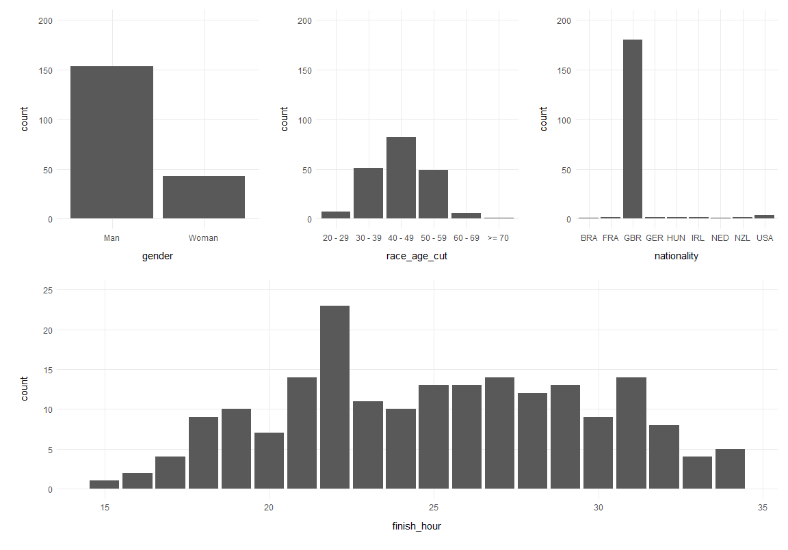
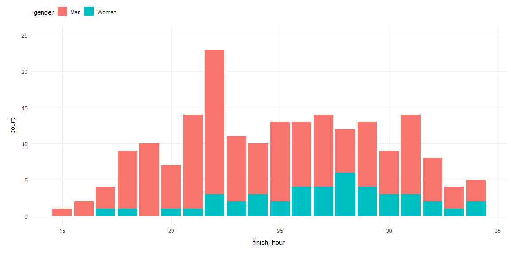
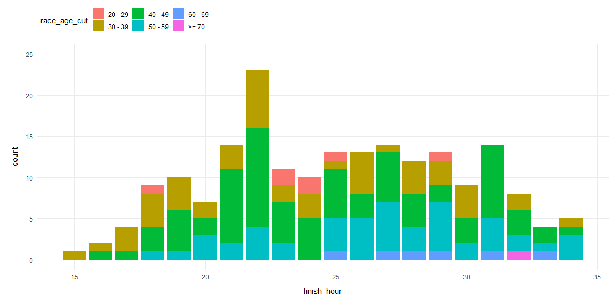
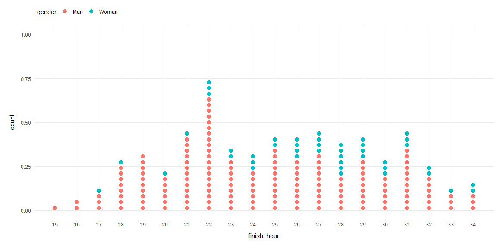
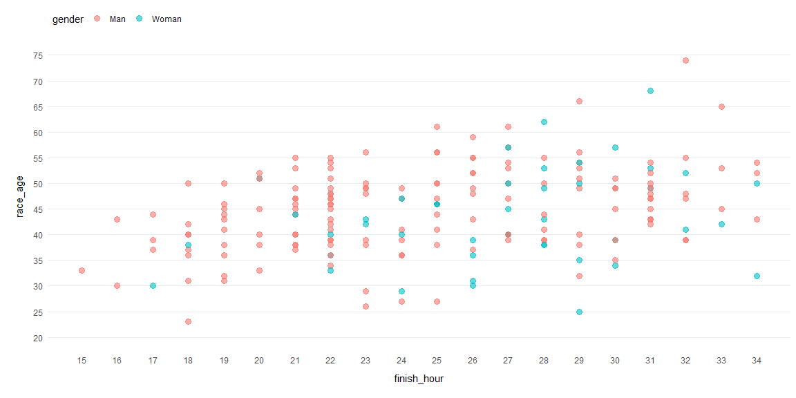
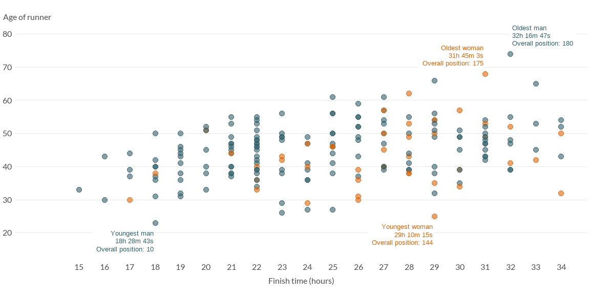

## Ultra Trail Running
The data this week was taken from the [International Trail Running Association (ITRA) website](https://itra.run/Races/FindRaceResults) and was made available to #TidyTuesday via [Benjamin Nowak](https://twitter.com/BjnNowak). The dataset provides a compilation of results from trail races that took place between 2012 - 2021 and focuses on 100 mile races (give or take a few miles). 


### Objectives
This week I'm going to focus on [The West Highland Way Race](https://westhighlandwayrace.org/); a 95 mile race from Milngavie (just north of Glasgow) to Fort William in the Scottish Highlands. It's one of the world’s longest established ultra-marathons and first took place in 1985. I chose this race because the start line is just a few miles from where I live.   

Due to the COVID-19 pandemic, the race was cancelled in 2020 and 2021, so I'm going to look at the most recent data available (2019). My objective is to visualise the distribution of finish times (in hours).


### Learning Points
This week I learned that a simple looking chart can take a long time to produce. I went down a number of rabbit holes looking at various chart types and at colours and fonts. My main learning points this week relate to:  

- **Dot Plots:** Not as simple as they seem. The y-axis in geom_dotplot() is not meaningful - it doesn't count the dots!.  

- **Colours:** I've done quite a bit of reading over the last few weeks about colour palettes, particularly in relation to [colour blindness and accessibility](https://blog.datawrapper.de/colorblindness-part1/). I used a great tool called [Viz Palette](https://projects.susielu.com/) that shows how various colour combinations look when viewed through the eyes of a person with a colour vision impairment. I also read an interesting article about [choosing colours when showing data by gender](https://blog.datawrapper.de/gendercolor/); it offers some ideas that don't involve the generic pink / blue combo.

- **Fonts:** I installed some [Google fonts](https://fonts.google.com/) on my laptop this week, so I wanted to try them out in my visualisations. I found a couple of great articles that helped me. The first one was about [choosing fonts for your data visualization](https://medium.com/nightingale/choosing-a-font-for-your-data-visualization-2ed37afea637). The second was about [understanding text size and resolution in ggplot2](https://www.christophenicault.com/post/understand_size_dimension_ggplot2/). This second one was really helpful in working out why charts within my R markdown file looked just fine, but looked awful when I saved them with ggsave().

- **Mapping Geographic Data:** Following on from #TidyTuesday [week 42](https://github.com/fi-lees/tidy_tuesday/tree/master/TT_2021_W42_Global_Seafood), I wanted some more practice mapping geographic data. [The West Highland Way Race website](https://westhighlandwayrace.org/map-and-gpx/) provides a gpx file with route data for the race. I learned how to read this type of data into R and plot it on a map.


### Load Packages
Load the required packages.  


```r
library(showtext)
library(sysfonts)
library(ggtext)
library(patchwork)
library(magick)
library(sf)
library(rnaturalearth)
library(tidyverse)
```


### Import Data
Import this week's data.  


```r
# Read in race details from the Tidy Tuesday github page
race <- readr::read_csv(
  "https://raw.githubusercontent.com/rfordatascience/tidytuesday/master/data/2021/2021-10-26/race.csv"
  )

# For the ranking data, use Benjamin's link so that time values above 24hrs are not lost
# (reading time as a character string)
rankings <- readr::read_csv(
  "https://raw.githubusercontent.com/BjnNowak/UltraTrailRunning/main/ranking.csv",
  col_types = list(Time = "c")
  )
```

Have an initial look at the `race` data.  


```r
# Race data
glimpse(race)
```

```
## Rows: 1,207
## Columns: 13
## $ race_year_id   <dbl> 68140, 72496, 69855, 67856, 70469, 66887, 67851, 68241,~
## $ event          <chr> "Peak District Ultras", "UTMB®", "Grand Raid des Pyréné~
## $ race           <chr> "Millstone 100", "UTMB®", "Ultra Tour 160", "PERSENK UL~
## $ city           <chr> "Castleton", "Chamonix", "vielle-Aure", "Asenovgrad", "~
## $ country        <chr> "United Kingdom", "France", "France", "Bulgaria", "Turk~
## $ date           <date> 2021-09-03, 2021-08-27, 2021-08-20, 2021-08-20, 2021-0~
## $ start_time     <time> 19:00:00, 17:00:00, 05:00:00, 18:00:00, 18:00:00, 17:0~
## $ participation  <chr> "solo", "Solo", "solo", "solo", "solo", "solo", "solo",~
## $ distance       <dbl> 166.9, 170.7, 167.0, 164.0, 159.9, 159.9, 163.8, 163.9,~
## $ elevation_gain <dbl> 4520, 9930, 9980, 7490, 100, 9850, 5460, 4630, 6410, 31~
## $ elevation_loss <dbl> -4520, -9930, -9980, -7500, -100, -9850, -5460, -4660, ~
## $ aid_stations   <dbl> 10, 11, 13, 13, 12, 15, 5, 8, 13, 23, 13, 5, 12, 15, 0,~
## $ participants   <dbl> 150, 2300, 600, 150, 0, 300, 0, 200, 120, 100, 300, 50,~
```

Have an initial look at the `rankings` data.    


```r
# Ranking data
glimpse(rankings)
```

```
## Rows: 137,803
## Columns: 7
## $ RaceYearId  <dbl> 68140, 68140, 68140, 68140, 68140, 68140, 68140, 68140, 68~
## $ Rank        <dbl> 1, 2, 3, 4, 5, 6, 7, 8, 9, 10, 11, 12, 13, NA, NA, NA, NA,~
## $ Runner      <chr> "VERHEUL Jasper", "MOULDING JON", "RICHARDSON Phill", "DYS~
## $ Time        <chr> "26:35:25", "27:00:29", "28:49:07", "30:53:37", "32:46:21"~
## $ Age         <dbl> 30, 43, 38, 55, 48, 31, 55, 40, 47, 29, 48, 47, 52, 49, 41~
## $ Gender      <chr> "M", "M", "M", "W", "W", "M", "W", "W", "M", "M", "M", "M"~
## $ Nationality <chr> "GBR", "GBR", "GBR", "GBR", "GBR", "GBR", "GBR", "GBR", "G~
```


### Wrangle Data
Tidy-up the `rankings` data.   


```r
# Clean up ranking column names and use the Lubridate package to convert the time variable to 
# a period showing hours, minutes and seconds
rankings <- rankings %>% 
  janitor::clean_names() %>% 
  mutate(time = lubridate::hms(time)) %>% 
  mutate(time_in_seconds = lubridate::duration(as.numeric(time), unit = "seconds"), 
         finish_hour = lubridate::hour(time),
         finish_minute = lubridate::minute(time),
         .after = time
         )
```

Join the `race` data to the `ranking` data.  


```r
race_rankings <- rankings %>% 
  left_join(race, by = "race_year_id")
```

Create a filtered dataset that holds records for the West Highland Way Race in 2019.  


```r
whwr_race_rankings <- race_rankings %>% 
  filter(event == "West Highland Way Race" & date == lubridate::ymd(20190622))
```

Create some new variables that might be useful for exploration.  


```r
whwr_race_rankings <- whwr_race_rankings %>% 
  # Calculate the runner's approx age at the time of the race
  # (the age recorded for each runner is their age in 2021, not their age at the time of the race)
  mutate(race_age = age - (2021 - lubridate::year(date)), .after = age) %>%
  # If age is unavailable / invalid, set to NA 
  # (after reading info on the race website, I'm going assume values below 16 or over 100 are invalid)
  mutate(race_age = case_when(
    (!between(race_age, 16, 100)) ~ NA_real_, 
    TRUE ~ race_age)
    ) %>% 
  # Create an age group variable
  mutate(race_age_cut = cut(
    race_age,
    breaks = c(15, 19, 29, 39, 49, 59, 69, 100),
    labels = c("< 20", "20 - 29", "30 - 39", "40 - 49", "50 - 59", "60 - 69", ">= 70")),
    .after = race_age) %>% 
  # Make gender and nationality factors
  mutate(
    gender = factor(gender, levels = c("M", "W"), labels = c("Man", "Woman")),
    nationality = factor(nationality)
    )
```


### Explore Data
Set-up a basic theme for charts before starting to explore the data.


```r
theme_set(theme_minimal())

theme_update(
  axis.title.x = element_text(margin = margin(t = 10, b = 10)),
  axis.title.y = element_text(margin = margin(r = 10, l = 10)),
  legend.position = "top",
  legend.justification = "left",
  panel.grid.minor = element_blank()
  )
```

Having a first look at the distributions of the variables I'm interested in:  

- More than 3/4 of the runners were men.  

- The most frequent age group was 40-49, but there's quite a nice distribution with a few runners in their 20s and a few who are 60 or older.  

- The vast majority of runners were from the UK (GBR).  

- The fastest runners finished in hour 15 of the race, the slowest in hour 34. There's a spike at hour 22.  


```r
p_gender <- whwr_race_rankings %>% 
  ggplot(aes(x = gender)) +
  geom_bar() +
  scale_y_continuous(limits = c(0, 200))

p_age_group <- whwr_race_rankings %>% 
  ggplot(aes(x = race_age_cut)) +
  geom_bar() +
  scale_y_continuous(limits = c(0, 200))

p_nationality <- whwr_race_rankings %>% 
  ggplot(aes(x = nationality)) +
  geom_bar() +
  scale_y_continuous(limits = c(0, 200))

p_finishing_hour <- whwr_race_rankings %>% 
  ggplot(aes(x = finish_hour)) +
  geom_bar() +
  scale_y_continuous(limits = c(0, 25))

# The patchwork package is loaded - use it to patch all the above charts together
(p_gender + p_age_group + p_nationality) /
  p_finishing_hour
```



**Q.** When did men / women finish the race?    
**A.** The men ranged between hour 15 and 34 (median = hour 24). The women ranged between hour 17 and 34 (median = hour 27).  


```r
whwr_race_rankings %>%
  group_by(gender) %>%
  summarise(
    n = n(),
    min_hour = min(finish_hour),
    Q1_hour = quantile(finish_hour, 0.25),
    median_hour = median(finish_hour),
    Q3_hour = quantile(finish_hour, 0.75),
    max_hour = max(finish_hour),
    mean_hour = mean(finish_hour),
    sd_hour = sd(finish_hour)
  )
```

```
## # A tibble: 2 x 9
##   gender     n min_hour Q1_hour median_hour Q3_hour max_hour mean_hour sd_hour
##   <fct>  <int>    <dbl>   <dbl>       <dbl>   <dbl>    <dbl>     <dbl>   <dbl>
## 1 Man      153       15      21          24    28         34      24.6    4.65
## 2 Woman     43       17      24          27    29.5       34      26.8    4.06
```


```r
whwr_race_rankings %>% 
  ggplot(aes(x = finish_hour, fill = gender)) +
  geom_bar() +
  scale_y_continuous(limits = c(0, 25))
```



**Q.** When did the different age groups finish the race?    
**A.** The 30-39 age group had the lowest mean and median finish hour (median = hour 23), but the 20-29 and 40-49 groups were also fast (median = hour 24).  


```r
whwr_race_rankings %>% 
  group_by(race_age_cut) %>% 
  summarise(
    n = n(),
    min_hour = min(finish_hour),
    Q1_hour = quantile(finish_hour, 0.25),
    median_hour = median(finish_hour),
    Q3_hour = quantile(finish_hour, 0.75),
    max_hour = max(finish_hour),
    mean_hour = mean(finish_hour),
    sd_hour = sd(finish_hour)
  )
```

```
## # A tibble: 6 x 9
##   race_age_cut     n min_hour Q1_hour median_hour Q3_hour max_hour mean_hour
##   <fct>        <int>    <dbl>   <dbl>       <dbl>   <dbl>    <dbl>     <dbl>
## 1 20 - 29          7       18    23          24      24.5       29      23.7
## 2 30 - 39         51       15    19.5        23      28         34      23.6
## 3 40 - 49         82       16    21.2        24      28         34      24.8
## 4 50 - 59         49       18    23          27      29         34      26.7
## 5 60 - 69          6       25    27.2        28.5    30.5       33      28.8
## 6 >= 70            1       32    32          32      32         32      32  
## # ... with 1 more variable: sd_hour <dbl>
```


```r
whwr_race_rankings %>% 
  ggplot(aes(x = finish_hour, fill = race_age_cut)) +
  geom_bar() +
  scale_y_continuous(limits = c(0, 25))
```



Okay, so I now have a better idea of the distribution of finish hour and how this relates to gender and age group, but the stacked bar charts above are not very lovely and could be vastly improved. 

There are only 196 people who completed this race, so I'd like to create a chart that displays the runners as individuals (i.e. dots); I like the idea of a runner being able to pick themselves out in this chart and think "that's me! However, I still want to be able to see the overall distribution of finish hour.

My first thought was to create a dot plot using geom_dotplot. Using this approach it's possible to turn each individual into a dot and still see the finish hour distribution. However, there are a few drawbacks:  

- The y-scale isn't meaningful; geom_dotplot() doesn't count the dots and messing about with the y-axis scale didn't fully solve this issue. This geom is more complex than I first realised. I could hide this axis (and add count labels to each bar), but I'd prefer an axis showing the counts.  

- Now that I see the bars made of dots, I like the idea of ordering the dots so that it's possible to see the finishing position of the runners within each hour. The chart below just sticks all the women at the top of each bar.  


```r
whwr_race_rankings %>% 
  ggplot(aes(x = finish_hour, fill = gender, colour = gender)) +
  geom_dotplot(dotsize = 0.2, stackratio = 1.3, method = "histodot", stackgroups = TRUE, binwidth = 1) + 
  #scale_y_continuous(limits = c(0, 25)) +
  scale_x_continuous(limits = c(15, 34), breaks = seq(15, 34, 1))
```



To show the count on the y-axis and order the runners by finishing time within each hour, I did two things:  

- I created a new variable  called `hour_rank`. It records the finishing position of each runner within each hour (it also acts as a count).   

- I switched to using geom_point() instead of geom_dotplot(). `hour_rank` is used to place each dot on the y-axis.  

The resulting chart is much closer to what I envisaged. The dots are ordered according to the runner's finishing position within each hour, with those who finished first shown at the bottom of each dotted bar.


```r
# Calculate the rank of each runner within each finishing hour
whwr_race_rankings <- whwr_race_rankings %>% 
  group_by(finish_hour) %>% 
  mutate(hour_rank = min_rank(time), .after = finish_minute) %>% 
  ungroup()
```


```r
# Draw the new chart
whwr_race_rankings %>% 
  ggplot(aes(x = finish_hour, y = hour_rank, colour = gender)) +
  geom_point(size = 3.5) +
  scale_y_continuous(limits = c(0, 25), breaks = seq(0, 25, 5)) +
  scale_x_continuous(limits = c(15, 34), breaks = seq(15, 34, 1)) +
  theme(panel.grid.major.x = element_blank())
```


Using the same principle, I created a similar chart for finish hour / age group. There are too many colours in this chart - it's a bit busy.  I tried using a single colour on a light-to-dark gradient, but I still found the chart tricky to process. I also tried binning age into fewer categories, but some of the detail I was interested in got lost.  


```r
whwr_race_rankings %>% 
  ggplot(aes(x = finish_hour, y = hour_rank, colour = race_age_cut)) +
  # Try out square dots
  geom_point(size = 3.5, shape = 15) +
  scale_y_continuous(limits = c(0, 25), breaks = seq(0, 25, 5)) +
  scale_x_continuous(limits = c(15, 34), breaks = seq(15, 34, 1)) +
  theme(panel.grid.major.x = element_blank())
```


In the end, I decided it would be more useful to retain the gender groupings and plot the finish hour data against the runner's age (a more conventional strip plot). This makes it easier to see the age range of runners who finished in each hour. It has the added benefit of retaining the runner's gender information. Placed along side the gender chart created above, I think this tells a more interesting story about the runners who finished in each hour. For example, you can see that everyone who finished by hour 24 was under 60 years of age.  


```r
whwr_race_rankings %>% 
  ggplot(aes(x = finish_hour, y = race_age, colour = gender)) +
  geom_point(size = 3, alpha = 0.6) +
  scale_y_continuous(limits = c(20, 75), breaks = seq(20, 75, 5)) +
  scale_x_continuous(limits = c(15, 34), breaks = seq(15, 34, 1)) +
  theme(panel.grid.major.x = element_blank())
```




### Visualise Data

Time to put it all together and build the final visualisation.  

First, set-up the fonts, colours and theme to be used in the final charts.  


```r
# Fonts
showtext_auto(enable = TRUE)
font_add_google("Lato")
font_add_google("Playfair Display")

# Colours
runner_colours = c("Man" = "#32616a", "Woman" = "#e06508")

# Theme
theme_set(theme_minimal())

theme_update(
  # Update fonts to be used
  text = element_text(colour = "gray30", family = "Lato"),
  plot.title = element_text(colour = "grey20", family = "Playfair Display", face = "bold", 
                            size = 18, margin = margin(t = 5, b = 5)),
  # Setting subtitle to ggtext:element_markdown() allows the colour / style of subtitle words to be changed
  plot.subtitle = element_markdown(size = 12.5, margin = margin(t = 10, b = 10), lineheight = 1.2),
  plot.caption = element_text(size = 10, margin = margin(t = 10), hjust = 0),
  plot.margin = margin(rep(4, 8)),
  plot.background = element_rect(color = "#ffffff", size = 0.5),
  axis.text = element_text(size = 12),
  axis.title.x = element_text(size = 12, margin = margin(t = 10, b = 10)),
  axis.title.y = element_text(size = 12, angle = 0, vjust = 1.01),
  panel.grid.minor = element_blank(),
  panel.grid.major.x = element_blank(),
  legend.position = "none"
  )
```

Get some information about the fastest / youngest / oldest runners for chart labelling.  
  

```r
# Basic info for each runner
whwr_race_rankings <- whwr_race_rankings %>% 
  mutate(runner_label = str_c(tolower(gender), "\n", tolower(as.character(time)), "\nOverall position: ", rank)) %>% 
  group_by(finish_hour) %>% 
  mutate(
    max_hour_rank = max(hour_rank),
    min_hour_age = min(race_age),
    max_hour_age = max(race_age)
    ) %>%
  ungroup()

# Fastest
whwr_fastest <- whwr_race_rankings %>% 
  group_by(gender) %>% 
  slice(which.min(time_in_seconds)) %>% 
  select(runner, rank, time, finish_hour, finish_minute, hour_rank, 
         race_age, gender, nationality, max_hour_rank, runner_label) %>% 
  mutate(runner_label = str_c("Fastest ", runner_label)) %>% 
  ungroup()

# Youngest
whwr_youngest <- whwr_race_rankings %>% 
  group_by(gender) %>% 
  slice(which.min(race_age)) %>% 
  select(runner, rank, time, finish_hour, finish_minute, hour_rank, 
         race_age, gender, nationality, min_hour_age, runner_label) %>% 
  mutate(runner_label = str_c("Youngest ", runner_label)) %>% 
  ungroup()

# Oldest
whwr_oldest <- whwr_race_rankings %>% 
  group_by(gender) %>% 
  slice(which.max(race_age)) %>% 
  select(runner, rank, time, finish_hour, finish_minute, hour_rank, 
         race_age, gender, nationality, max_hour_age, runner_label) %>% 
  mutate(runner_label = str_c("Oldest ", runner_label)) %>% 
  ungroup()
```

Create the final chart showing the number of runners who finished in each hour, by gender.  


```r
p_gender_final <- whwr_race_rankings %>% 
  ggplot(aes(x = finish_hour, y = hour_rank, colour = gender)) +
  geom_point(size = 3.5, alpha = 0.8) +
  # Use pre-defined colour palette
  scale_colour_manual(values = runner_colours) +
  # Make a bit of extra space along the x + y-axis for labels
  scale_y_continuous(limits = c(1, 25.7), breaks = seq(5, 25, 5)) +
  scale_x_continuous(limits = c(13.5, 34), breaks = seq(15, 34, 1)) +
  # Add labels for fastest man and woman 
  geom_label(
    data = whwr_fastest,
    aes(x = finish_hour, y = (max_hour_rank + 2), label = runner_label),
    label.size = NA,
    size = 3.5,
    hjust = 1,
    vjust = 0.5,
    lineheight = 0.95
  ) +
  theme(axis.title.y = element_text(margin = margin(r = -100))) +
  labs(
    subtitle = "",
    x = " ",
    y = "Number of runners"
    )

p_gender_final
```


Create the final chart showing finishing hour versus the runner's age, by gender.  


```r
p_age_final <- whwr_race_rankings %>% 
  ggplot(aes(x = finish_hour, y = race_age, colour = gender)) +
  geom_point(size = 3.5, alpha = 0.6) +
  # Use pre-defined colour palette
  scale_colour_manual(values = runner_colours) +
  # Make a bit of extra space along the x + y-axis for labels
  scale_y_continuous(limits = c(15, 82), breaks = seq(20, 80, 10)) +
  scale_x_continuous(limits = c(13.5, 34), breaks = seq(15, 34, 1)) +
  # Add label for oldest man
  geom_label(
    data = filter(whwr_oldest, gender == "Man"),
    aes(x = finish_hour, y = max_hour_age + 5.5, label = runner_label),
    label.size = NA,
    size = 3.5,
    hjust = 0,
    vjust = 0.5,
    lineheight = 0.95
  ) +
  # Add label for oldest woman
  geom_label(
    data = filter(whwr_oldest, gender == "Woman"),
    aes(x = finish_hour, y = max_hour_age + 5.5, label = runner_label),
    label.size = NA,
    size = 3.5,
    hjust = 1,
    vjust = 0.5,
    lineheight = 0.95
  ) +
  # Add labels for youngest man + woman
  geom_label(
    data = whwr_youngest,
    aes(x = finish_hour, y = min_hour_age - 5.5, label = runner_label),
    label.size = NA,
    size = 3.5,
    hjust = 1,
    vjust = 0.5,
    lineheight = 0.95
  ) +
  theme(axis.title.y = element_text(margin = margin(r = -73))) +
  labs(
    subtitle = "",
    x = "Finish time (hours)",
    y = "Age of runner"
    )

p_age_final
```



Put the charts together.  


```r
# Use Patchwork package to patch gender and age charts together into one
p_final <- p_gender_final /
  p_age_final

# Add plot titles
p_final <- p_final + 
  plot_annotation(
    title = "The West Highland Way Race: Finishing Times (hours), 2019",
    # Colour code the words man / woman to match charts
    subtitle = "In 2019, 196 runners completed the 95 mile race from Milngavie (just north of Glasgow) to
  Fort William in the Scottish Highlands.<br>Each dot represents a runner who completed the race (
  <b style='color: #32616a;'>153 men</b>
  /
  <b style='color: #e06508;'>43 women</b>
  ).",
  caption = "Tidy Tuesday: Week 42, 2021 | Data source: International Trail Running Association  &  westhighlandwayrace.org | Visualisation: @Fi_Lees"
  )

p_final
```


  
Save this visualisation as an image.


```r
# Tell showtext to use a DPI of 300 so that the text size is correct in the final saved chart.
showtext_opts(dpi = 300)

ggsave("whwr_2019.png", p_final, width = 12, height = 12, units = "in", dpi = 300)
```

One last thing. I'd like to add a small map showing the West Highland Way Race route. I have a gpx file with the route data; I want to import the gpx data and get it into a simple features (sf) format so that I can plot it on top of a map of Scotland. I can use the `sf` package to do this.


```r
# What layers are available in the West Highland Way Race gpx file?
st_layers("West_Highland_Way_Race_2019.gpx")
```

```
## Driver: GPX 
## Available layers:
##     layer_name     geometry_type features fields
## 1    waypoints             Point        0     23
## 2       routes       Line String        0     12
## 3       tracks Multi Line String        1     12
## 4 route_points             Point        0     25
## 5 track_points             Point   100746     27
```

```r
# Get the West Highland Way Race track_points data
whwr_route <- st_read("West_Highland_Way_Race_2019.gpx", layer = "track_points")
```

```
## Reading layer `track_points' from data source 
## Simple feature collection with 100746 features and 27 fields
## Geometry type: POINT
## Dimension:     XY
## Bounding box:  xmin: -5.110399 ymin: 55.94148 xmax: -4.314881 ymax: 56.82212
## Geodetic CRS:  WGS 84
```

```r
# Keep columns with useful data - drop the rest
whwr_route <- whwr_route %>% 
  select(track_fid:time, gpxtpx_TrackPointExtension, geometry)

# Get the start and end points of race
whwr_route_start_finish <- whwr_route %>% 
  mutate(
    start = min(track_seg_point_id),
    end = max(track_seg_point_id)
    ) %>% 
  filter(track_seg_point_id == start | track_seg_point_id == end) 

# Use the ne_states() function from the rnaturalearth package to load boundary data for the UK
uk_sf <- ne_states(country = "united kingdom", returnclass = "sf")

# Get data for Scotland
scot_sf <- filter(uk_sf, geonunit == "Scotland")
```

Draw the map and route.   


```r
# Plot the route of the West Highland Way Race on top of the map of Scotland
p_whwr_map <- ggplot() +
  # Scotland boundary
  geom_sf(data = scot_sf, fill = "#cbe2e7",  colour = "#cbe2e7") +
  # Race route
  geom_sf(data = whwr_route, size = 0.05, colour = "#32616a") +
  # Start and end points
  geom_sf(data = whwr_route_start_finish, size = 2.5, colour = "#e06508") +
  # Trim longitude / latitude coordinates to fit mainland Scotland  
  coord_sf(xlim = c(-8, -1.5), ylim = c(54.8, 58.55)) +
  # Remove all standard lines / labels from chart
  theme_void()

p_whwr_map
```


Save the map as an image.  


```r
ggsave("whwr_map.png", p_whwr_map, width = 2, height = 2.5, units = "in", dpi = 300)
```

Using the `magick` package, add the map image to the top right-hand corner of the final chart image and save.  


```r
# Get the final chart
chart <- image_read("whwr_2019.png")

# Get the map and then rescale it
map <- image_read("whwr_map.png")
map_scaled <- image_scale(map, "x500")

# Add the map to the chart and then save
whwr_2019_with_map <- image_composite(chart, map_scaled, offset = "+3100")
whwr_2019_with_map <- image_border(whwr_2019_with_map, "#ffffff", "30x20")
image_write(whwr_2019_with_map, path = "whwr_2019_with_map.png", format = "png")
```


### Session Information

```r
sessionInfo()
```

```
## R version 4.1.1 (2021-08-10)
## Platform: x86_64-w64-mingw32/x64 (64-bit)
## Running under: Windows 10 x64 (build 22000)
## 
## Matrix products: default
## 
## locale:
## [1] LC_COLLATE=English_United Kingdom.1252 
## [2] LC_CTYPE=English_United Kingdom.1252   
## [3] LC_MONETARY=English_United Kingdom.1252
## [4] LC_NUMERIC=C                           
## [5] LC_TIME=English_United Kingdom.1252    
## 
## attached base packages:
## [1] stats     graphics  grDevices utils     datasets  methods   base     
## 
## other attached packages:
##  [1] forcats_0.5.1       stringr_1.4.0       dplyr_1.0.7        
##  [4] purrr_0.3.4         readr_2.0.2         tidyr_1.1.4        
##  [7] tibble_3.1.5        ggplot2_3.3.5       tidyverse_1.3.1    
## [10] rnaturalearth_0.1.0 sf_1.0-3            magick_2.7.3       
## [13] patchwork_1.1.1     ggtext_0.1.1        showtext_0.9-4     
## [16] showtextdb_3.0      sysfonts_0.8.5     
## 
## loaded via a namespace (and not attached):
##  [1] fs_1.5.0                 lubridate_1.8.0          bit64_4.0.5             
##  [4] httr_1.4.2               tools_4.1.1              backports_1.2.1         
##  [7] bslib_0.3.1              utf8_1.2.2               R6_2.5.1                
## [10] KernSmooth_2.23-20       rgeos_0.5-8              DBI_1.1.1               
## [13] colorspace_2.0-2         withr_2.4.2              sp_1.4-5                
## [16] tidyselect_1.1.1         bit_4.0.4                curl_4.3.2              
## [19] compiler_4.1.1           textshaping_0.3.5        cli_3.0.1               
## [22] rvest_1.0.1              xml2_1.3.2               labeling_0.4.2          
## [25] sass_0.4.0               scales_1.1.1             classInt_0.4-3          
## [28] proxy_0.4-26             systemfonts_1.0.2        digest_0.6.28           
## [31] rmarkdown_2.11           pkgconfig_2.0.3          htmltools_0.5.2         
## [34] dbplyr_2.1.1             fastmap_1.1.0            highr_0.9               
## [37] rlang_0.4.11             readxl_1.3.1             rstudioapi_0.13         
## [40] jquerylib_0.1.4          generics_0.1.0           farver_2.1.0            
## [43] jsonlite_1.7.2           vroom_1.5.5              magrittr_2.0.1          
## [46] s2_1.0.7                 Rcpp_1.0.7               munsell_0.5.0           
## [49] fansi_0.5.0              lifecycle_1.0.1          stringi_1.7.5           
## [52] yaml_2.2.1               snakecase_0.11.0         grid_4.1.1              
## [55] parallel_4.1.1           crayon_1.4.1             lattice_0.20-45         
## [58] haven_2.4.3              gridtext_0.1.4           hms_1.1.1               
## [61] knitr_1.36               pillar_1.6.3             markdown_1.1            
## [64] wk_0.5.0                 reprex_2.0.1             glue_1.4.2              
## [67] evaluate_0.14            modelr_0.1.8             vctrs_0.3.8             
## [70] tzdb_0.1.2               cellranger_1.1.0         gtable_0.3.0            
## [73] assertthat_0.2.1         xfun_0.26                janitor_2.1.0           
## [76] broom_0.7.9              e1071_1.7-9              rnaturalearthhires_0.2.0
## [79] ragg_1.1.3               class_7.3-19             units_0.7-2             
## [82] ellipsis_0.3.2
```


