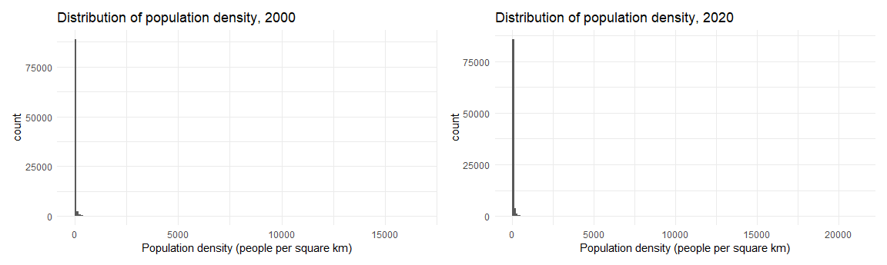
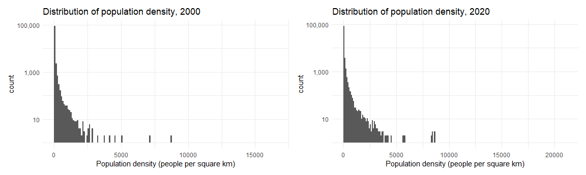
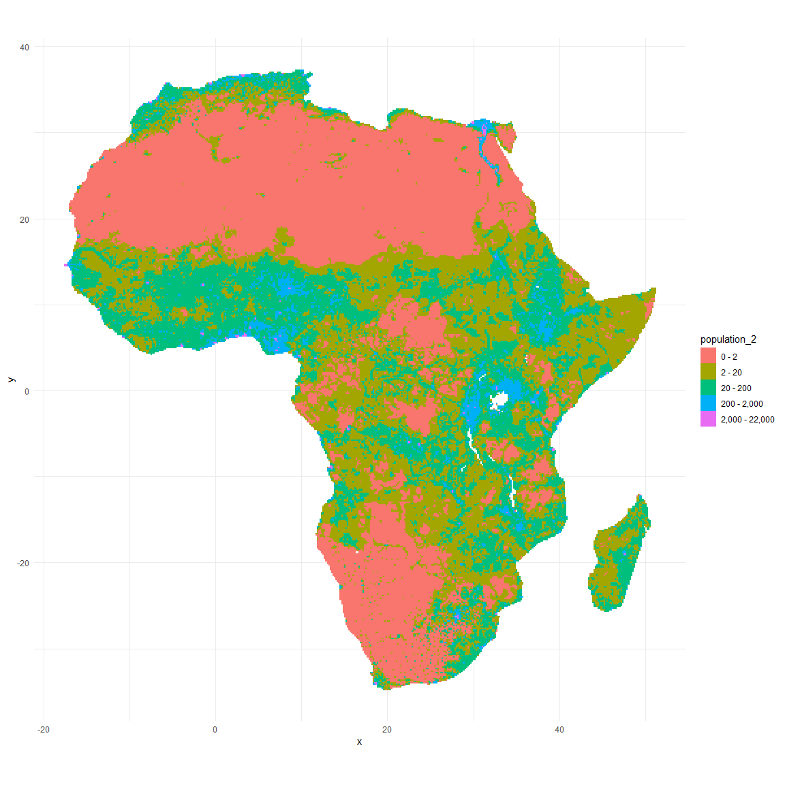
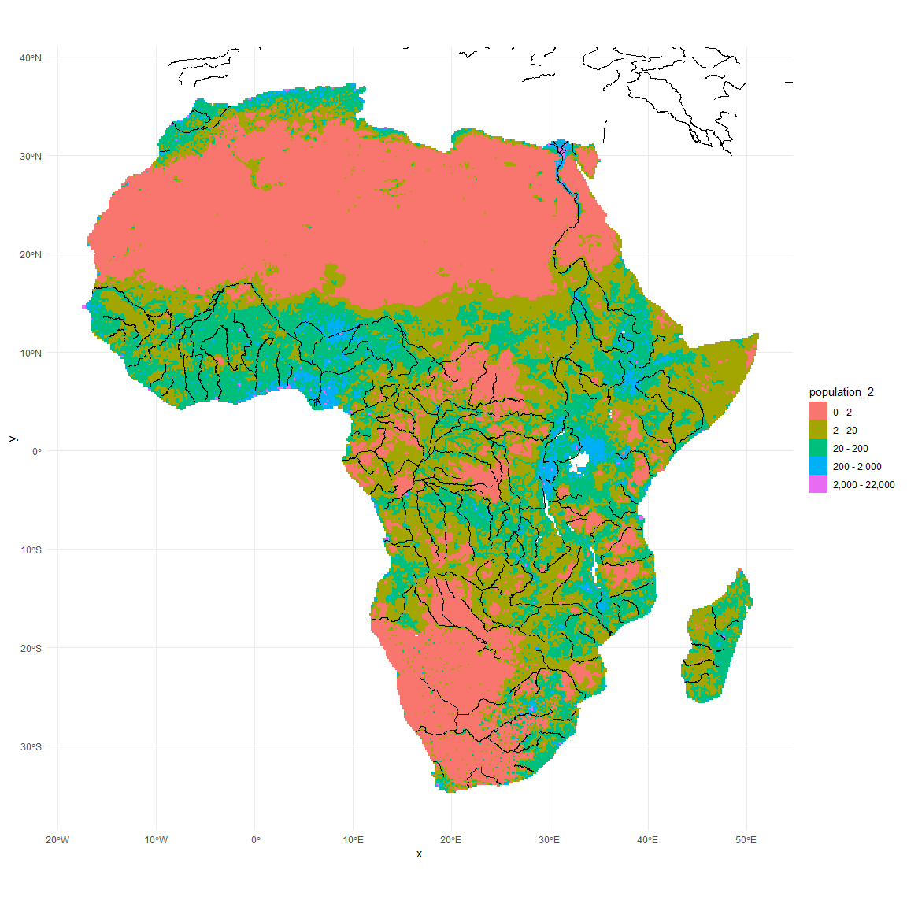
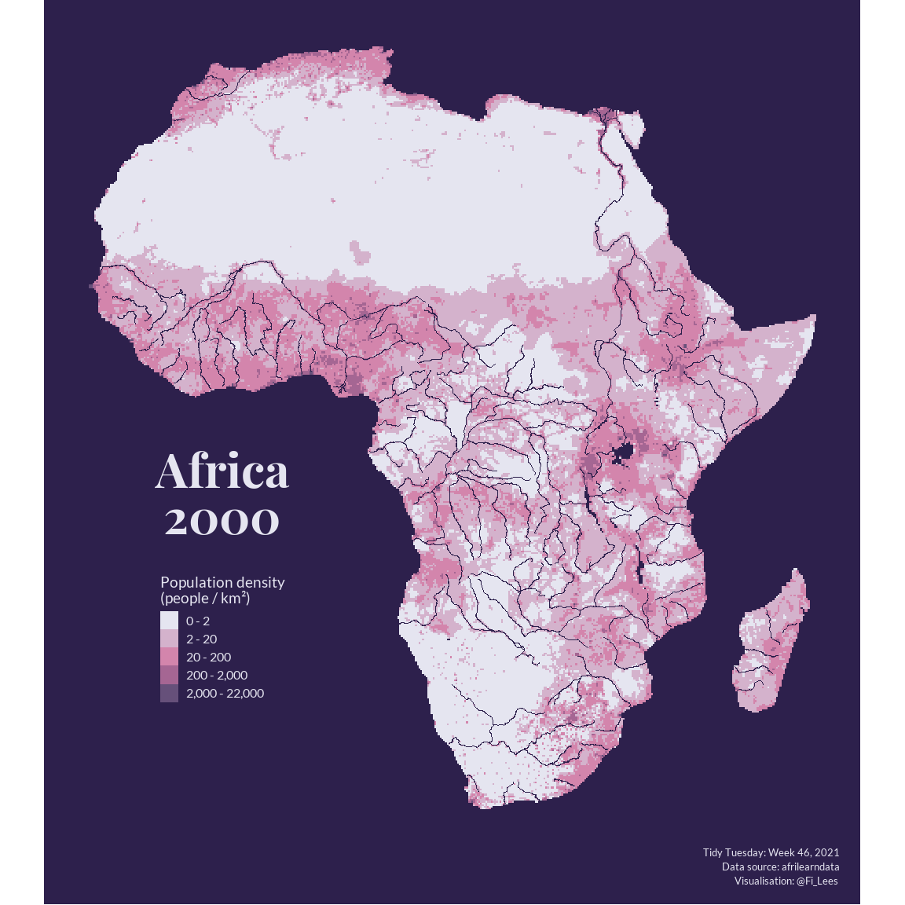
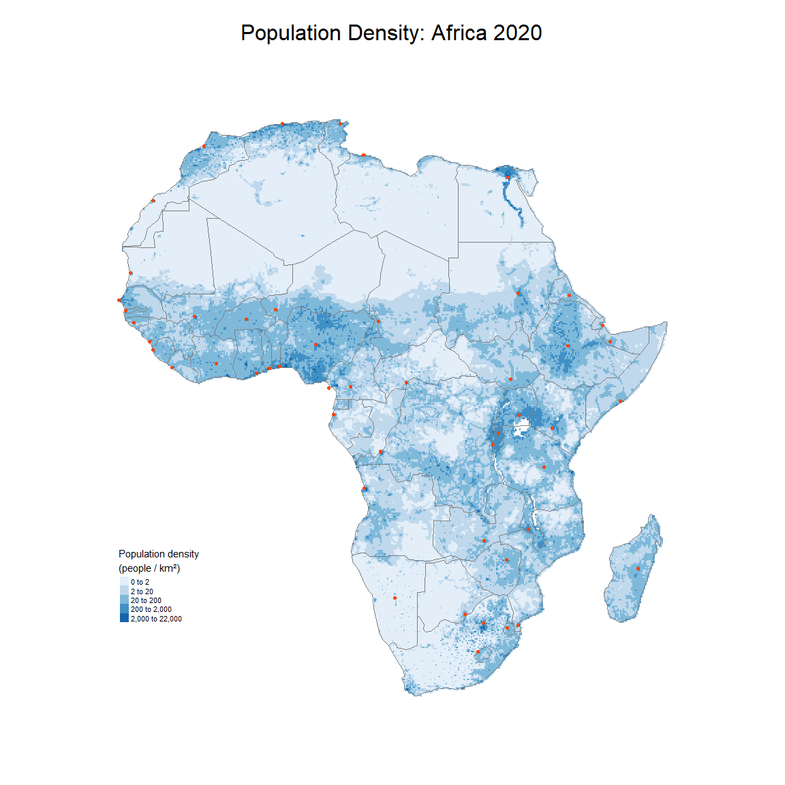

## AfriLearnData
The data this week is provided by [`afrilearndata`](https://afrimapr.github.io/afrilearndata/). This package provides small African spatial datasets to help with the learning and teaching of spatial techniques and mapping. Its purpose is to provide analysts based in Africa with relatable example datasets. More generally it aims to support the growth of R and mapping in Africa. It's part of the afrimapr project, providing R building blocks, training and community.  


### Objectives
This week I'm going to take a closer look at African population density data for the years 2000 (`afripop2000`) and 2020 (`afripop2020`). The data consist of two raster grids showing the estimated population density per square km, aggregated to mean per 20km square, in Africa. The projection is Geographic Coordinate System, WGS84.  

My plan is to draw a map for each year showing population density.  


### Learning Points
This week I learned I still have **a lot** to learn about drawing maps; even simple ones can be tricky. I definitely have renewed respect for cartographers. The main things I learned this week related to:  

- **Raster Data:** Apart from briefly reading about raster data in an on-line tutorial, I hadn't used it before. Raster data contains cells that have values assigned to them. The raster data in `afripop2000` and `afripop2020` has a cell for each 20km square in Africa; the x and y values associated with each cell give its geographic location (x = longitude, y = latitude). The value assigned to each cell is the estimated population density per square km for that 20km square.  

- **Colour (again):** Choosing the right colours for any visualisation can be tricky, but I find this to be especially true for raster data. Although I don't discuss them all in this document, I played around with several palettes specifically designed for cartographic data (`RColorBrewer`, `rcartocolor` and `scico`). There was a really helpful [Twitter thread](https://twitter.com/geokaramanis/status/1458495769217060878) about the use of colour specifically relating to this dataset.  

- **Animated JPEGs**: Via a great [TidyTuesday visualisation I saw on Twitter](https://twitter.com/georgeryang/status/1458209549287051265), I learned how to use the `magick` package to create an animated JPEG that switches between maps showing the 2000 and 2020 population density data.  


### Load Packages
Load the required packages.  


```r
library(afrilearndata)
library(raster)
library(sf)
library(rnaturalearth)
library(patchwork)
library(magick)
library(scico)
library(showtext)
library(tidyverse)
```


### Import Data
The `afrilearndata` package permits lazy loading (LazyData: true); a technique to load or process data only when needed. I've loaded the `afrilearndata` package already, so I can access the objects that contain the population density data directly.


```r
# Just looking at the population data for the year 2000 shows me that it's raster data
afripop2000
```

```
## class      : RasterLayer 
## dimensions : 434, 413, 179242  (nrow, ncol, ncell)
## resolution : 0.1666667, 0.1666667  (x, y)
## extent     : -17.62625, 51.20708, -34.97542, 37.35792  (xmin, xmax, ymin, ymax)
## crs        : +proj=longlat +datum=WGS84 +no_defs 
## source     : memory
## names      : ppp_2000_1km_Aggregated 
## values     : 0, 16606.66  (min, max)
```

```r
# Coerce the raster layer data into a data frame with spatial coordinates so that we have the option of using ggplot to visualise this data
afripop_2000_df <- afripop2000 %>%
  as.data.frame(xy = TRUE) %>%
  # Tidy-up variable names
  rename(population = ppp_2000_1km_Aggregated) %>%
  # Remove rows with no population data
  filter(!is.na(population))

# Repeat for 2020 data
afripop2020
```

```
## class      : RasterLayer 
## dimensions : 434, 413, 179242  (nrow, ncol, ncell)
## resolution : 0.1666667, 0.1666667  (x, y)
## extent     : -17.62625, 51.20708, -34.97542, 37.35792  (xmin, xmax, ymin, ymax)
## crs        : +proj=longlat +datum=WGS84 +no_defs 
## source     : memory
## names      : ppp_2020_1km_Aggregated 
## values     : 0, 21181.16  (min, max)
```

```r
afripop_2020_df <- afripop2020 %>%
  as.data.frame(xy = TRUE) %>%
  rename(population = ppp_2020_1km_Aggregated) %>%
  filter(!is.na(population))
```

By running a quick summary on each dataset I can see that the x / y (lon / lat) boundaries are the same in each. I can also see that the range in the population variable is **huge** (in 2020 it spans from 0 to 21,181 people per square km), but the data are extremely skewed (very long tail to the right). To be fair, I already got a lot of this information from the steps above, but running the summary helped me to see how skewed the data are.


```r
summary(afripop_2000_df)
```

```
##        x                y             population       
##  Min.   :-17.54   Min.   :-34.725   Min.   :    0.000  
##  1st Qu.:  7.29   1st Qu.: -6.725   1st Qu.:    0.168  
##  Median : 20.12   Median :  9.275   Median :    2.495  
##  Mean   : 18.24   Mean   :  6.436   Mean   :   22.908  
##  3rd Qu.: 29.96   3rd Qu.: 20.441   3rd Qu.:   13.244  
##  Max.   : 51.12   Max.   : 37.275   Max.   :16606.657
```

```r
summary(afripop_2020_df)
```

```
##        x                y             population       
##  Min.   :-17.54   Min.   :-34.725   Min.   :    0.000  
##  1st Qu.:  7.29   1st Qu.: -6.725   1st Qu.:    0.278  
##  Median : 20.12   Median :  9.275   Median :    4.358  
##  Mean   : 18.24   Mean   :  6.436   Mean   :   39.905  
##  3rd Qu.: 29.96   3rd Qu.: 20.441   3rd Qu.:   23.608  
##  Max.   : 51.12   Max.   : 37.275   Max.   :21181.162
```


### Explore Data
I'd like to take a closer look at the distribution of the population variable in both years. My first attempt (below) is not very informative. The data are so right-skewed I can't see anything useful.  


```r
# Set theme to minimal
theme_set(theme_minimal())

# Chart for 2000 data
p_dist_2000 <- afripop_2000_df %>%
  ggplot() +
  geom_histogram(aes(x = population), binwidth = 100, boundary = 0) +
  labs(title = "Distribution of population density, 2000",
       x = "Population density (people per square km)")

# Chart for 2020 data
p_dist_2020 <- afripop_2020_df %>%
  ggplot() +
  geom_histogram(aes(x = population), binwidth = 100, boundary = 0) +
  labs(title = "Distribution of population density, 2020",
       x = "Population density (people per square km)")

# Patchwork is loaded so I can patch the charts together into one
p_dist_2000 + p_dist_2020
```



I can log-transform the y-axis (count) to get a better look at what's going on.  


```r
p_dist_2000 <- p_dist_2000 +
  scale_y_log10(labels = scales::comma)

p_dist_2020 <- p_dist_2020 +
  scale_y_log10(labels = scales::comma)

p_dist_2000 + p_dist_2020
```



Now, let's try looking at the distribution data as a table. I'll add proportion and cumulative proportion information too. It's now much clearer that the vast majority of areas have a population density of less than 100; more than 99% of areas have a population density below 600. This applies to both years.


```r
afripop_2000_df %>%
  count(cut_width(population, width = 100, boundary = 0)) %>%
  mutate(
    prop = proportions(n),
    cum_prop = round(cumsum(prop), 4),
    prop = round(prop, 4)
  ) %>%
  slice_head(n = 10)
```

```
##    cut_width(population, width = 100, boundary = 0)     n   prop cum_prop
## 1                                           [0,100] 88852 0.9581   0.9581
## 2                                         (100,200]  2291 0.0247   0.9828
## 3                                         (200,300]   685 0.0074   0.9902
## 4                                         (300,400]   297 0.0032   0.9934
## 5                                         (400,500]   163 0.0018   0.9952
## 6                                         (500,600]    89 0.0010   0.9961
## 7                                         (600,700]    58 0.0006   0.9968
## 8                                         (700,800]    43 0.0005   0.9972
## 9                                         (800,900]    37 0.0004   0.9976
## 10                                      (900,1e+03]    37 0.0004   0.9980
```

```r
afripop_2020_df %>%
  count(cut_width(population, width = 100, boundary = 0)) %>%
  mutate(
    prop = proportions(n),
    cum_prop = round(cumsum(prop), 4),
    prop = round(prop, 4)
  ) %>%
  slice_head(n = 10)
```

```
##    cut_width(population, width = 100, boundary = 0)     n   prop cum_prop
## 1                                           [0,100] 85759 0.9248   0.9248
## 2                                         (100,200]  3742 0.0404   0.9651
## 3                                         (200,300]  1322 0.0143   0.9794
## 4                                         (300,400]   590 0.0064   0.9857
## 5                                         (400,500]   357 0.0038   0.9896
## 6                                         (500,600]   215 0.0023   0.9919
## 7                                         (600,700]   146 0.0016   0.9935
## 8                                         (700,800]   104 0.0011   0.9946
## 9                                         (800,900]    77 0.0008   0.9954
## 10                                      (900,1e+03]    58 0.0006   0.9961
```


### Wrangle Data
Viewing some other #TidyTuesday visualisations for week 46 that also looked at population density, I've been back and forth a bit around how to bin the data and whether or not to show it on a continuous scale.   

Like some other TidyTuesday-ers ([1](https://twitter.com/geokaramanis/status/1458495769217060878?s=20), [2](https://twitter.com/NearandDistant/status/1458550050330664961)) I was initially tempted to bin all values over 400 or 600 together and focus on differences at the lower end of the scale (because that's where the vast majority of the data points are). However, after some trial and error, reading [some discussion on this topic](https://twitter.com/afrimapr/status/1458515064349241347), and seeing some other options ([1](https://twitter.com/georgeryang/status/1458209549287051265), [2](https://twitter.com/datasciencejenn/status/1458543798074499076)), I'm persuaded that it's more interesting to see differences between areas of very small and very large population density.

Based on this I'm going to bin population density using the following breaks: 0, 2, 20, 200, 2000, 22000. I'll also use a discrete scale rather than a continuous one.  


```r
afripop_2000_df <- afripop_2000_df %>%
  mutate(population_2 = cut(
    population,
    breaks = c(-0.1, 2, 20, 200, 2000, 22000),
    labels = c("0 - 2", "2 - 20", "20 - 200", "200 - 2,000", "2,000 - 22,000")
  ))

afripop_2020_df <- afripop_2020_df %>%
  mutate(population_2 = cut(
    population,
    breaks = c(-0.1, 2, 20, 200, 2000, 22000),
    labels = c("0 - 2", "2 - 20", "20 - 200", "200 - 2,000", "2,000 - 22,000")
  ))
```

Just to get a sense of what the population density looks like, I'll draw a very quick plot of the 2020 data with no special formatting / labelling (oh, those default colours are hurting my eyes!)


```r
ggplot(data = afripop_2020_df) +
  # geom_raster plots the raster data, but you could also use geom_tile
  geom_raster(aes(x, y, fill = population_2)) +
  coord_fixed()
```



Looking at the initial map above, it occurs to me that Africa seems more densely populated around its coastline, lakes, rivers. I'd like to be able to see this more clearly by showing the main rivers on the map. The `afrilearndata` package doesn't have data for African rivers, but I know the `rnaturalearth` package has river information for the whole world (I saw this a few weeks ago in a tutorial called [Mapping Geographic Data in R, with ggplot2](https://flowingdata.com/mapping-in-r-ggplot2/) on the Flowing Data website.)  

I'm going to pull the global river information in and see if I can add it to my plot.  


```r
rivers <- ne_download(scale = 10, type = "rivers_lake_centerlines", category = "physical", returnclass = "sf")
```

```
## OGR data source with driver: ESRI Shapefile 
## Source: "C:\Users\FiLee\AppData\Local\Temp\Rtmpm891Da", layer: "ne_10m_rivers_lake_centerlines"
## with 1455 features
## It has 34 fields
## Integer64 fields read as strings:  rivernum ne_id
```


```r
ggplot(data = afripop_2020_df) +
  geom_raster(aes(x, y, fill = population_2)) +
  geom_sf(data = rivers) +
  # Trim longitude / latitude coordinates to fit Africa otherwise we'll see rivers across the world
  # I'll use the min / max coordinates in the afripop datasets as a guide.
  coord_sf(xlim = c(-17.62625, 51.20708), ylim = c(-34.97542, 37.35792))
```




### Visualise Data
Okay, now I'll try to tidy everything up and make the map look a bit nicer.

First, I'll set-up the fonts I want to use.  


```r
# Load fonts
font_add_google("Lato")
font_add_google("Playfair Display")

# Use showtext to render the text
showtext_auto(TRUE)
```

Having messed about with various colour palettes (not shown here), I decided to use one from the `scico` package called **acton**. However, I'm only going to use part of this palette to show the population data. I want to grab the darkest colour in the palette to use as a background colour (ocean). I'm doing this for two reasons:  

1) It was hard to find a colour to use as a background that didn't clash with the acton palette. By using a colour from the palette itself, the colour scheme for the whole map remains cohesive.  

2) I tried using various light coloured backgrounds, but this caused the large lakes in Africa (e.g. Lake Victoria) to get lost in amongst the population density data. I really want the lakes to look like lakes, not areas of low population density. I can also use this dark colour for the rivers.  

I'm going to call the palette directly when I draw the maps, but by reading the palette into a variable at this stage it's easy for me to see the hex values for each colour. This means I can pick out the darkest one to use for the background and the lightest one to use for the text. 


```r
(pop_den_colour <- scico(n = 15, palette = "acton", direction = 1))
```

```
##  [1] "#2D204C" "#41315D" "#54426E" "#6A527E" "#825E8A" "#996592" "#AD6795"
##  [8] "#C36D9A" "#D27EA7" "#D58FB3" "#D29FBF" "#D4AFCA" "#D8C0D6" "#DED2E2"
## [15] "#E5E5F0"
```


Now to build the map for the year 2000.


```r
# Build a base plot
p_map_base <- ggplot(data = afripop_2000_df) +
  geom_raster(aes(x, y, fill = population_2)) +
  # Use only the lightest 80% of the acton colour palette for the population data
  scale_fill_scico_d(direction = -1, palette = "acton", begin = 0.2, end = 1) +
  geom_sf(data = rivers, colour = "#2D204C", size = 0.3) +
  # Trim longitude / latitude coordinates to fit Africa 
  coord_sf(xlim = c(-17.62625, 51.20708), ylim = c(-34.97542, 37.35792)) +
  # Remove all grid lines etc.
  theme_void() +
  theme(
    text = element_text(family = "Lato", colour = "#E5E5F0"),
    plot.caption = element_text(size = 10, margin = margin(b = 10), hjust = 0.98, lineheight = 1.1),
    plot.background = element_rect(colour = NA, fill = "#2D204C"),
    legend.position = c(0.21, 0.25),
    legend.text = element_text(size = 12),
    legend.title = element_text(size = 14),
    plot.margin = margin(rep(8, 8)),
    ) +
  labs(
    caption = "Tidy Tuesday: Week 46, 2021\n Data source: afrilearndata\n Visualisation: @Fi_Lees",
    fill = "Population density\n(people / km²)"
    )

# Add year 2000 label to the plot - positioning it above the legend
p_map_2000 <- p_map_base +
  annotate("text", -5, -5, label = "Africa\n2000", 
           size = 16, family = "Playfair Display", fontface = "bold", 
           colour = "#E5E5F0", lineheight = 0.8)

p_map_2000
```



Using the base plot created above, swap the 2000 data for the 2020 data and create a map for 2020.


```r
# Update base plot with 2020 data and add year 2020 label
p_map_2020 <- p_map_base %+% afripop_2020_df +
    annotate("text", -5, -5, label = "Africa\n2020", 
           size = 16, family = "Playfair Display", fontface = "bold", 
           colour = "#E5E5F0", lineheight = 0.8)

p_map_2020
```


Save both maps as images.  


```r
# Tell showtext to use DPI of 300 so text size is correct when chart is saved as an image
showtext_opts(dpi = 300)

ggsave("p_map_2000.png", p_map_2000, width = 10, height = 10, units = "in", dpi = 300)
ggsave("p_map_2020.png", p_map_2020, width = 10, height = 10, units = "in", dpi = 300)

# Turn off showtext
showtext_auto(FALSE)
```

My original plan was to show the maps for 2000 and 2020 side-by side, but I came across a [cool idea on Twitter, posted by another TidyTuesday-er](https://twitter.com/georgeryang/status/1458209549287051265), showing an animated JPEG that switches between the two years. Using the code he posted, I was able to create a JPEG too. Thank you George!


```r
# Create GIF using magick package
list.files(path = ".", pattern = '*.png') %>% 
  image_read() %>%
  image_join() %>%
  image_animate(fps = 0.5) %>%
  image_write("africa_pop_density_animated.gif")
```


### Final Notes
As in previous weeks I've used ggplot to create my maps, but it was interesting to see other packages being used in this week's TidyTuesday. I had planned to try out the `tmap` package and compare it to ggplot, but I ran out of time (messing about with colour). I'm putting this note here as a reminder to myself to explore `tmap` further when I have time. Here is a quick demo of `tmap` below.  


```r
library(tmap)

tm_shape(afripop2020) +
  tm_raster(title = "Population density\n(people / km²)",
            breaks = c(0, 2, 20, 200, 2000, 22000),
            palette = "Blues") + 
  tm_shape(africountries) +
  tm_borders(col = "grey50") +
  tm_shape(africapitals) +
  tm_dots(size = 0.12, col = "orangered1") +
  tm_layout(main.title = "Population Density: Africa 2020",
            inner.margins = c(top = 0.1),
            frame = FALSE,
            legend.position = c(0.1, 0.2),
            main.title.position = "centre",
            main.title.size = 2
            )
```




### Session Information

```r
sessionInfo()
```

```
## R version 4.1.2 (2021-11-01)
## Platform: x86_64-w64-mingw32/x64 (64-bit)
## Running under: Windows 10 x64 (build 22000)
## 
## Matrix products: default
## 
## locale:
## [1] LC_COLLATE=English_United Kingdom.1252 
## [2] LC_CTYPE=English_United Kingdom.1252   
## [3] LC_MONETARY=English_United Kingdom.1252
## [4] LC_NUMERIC=C                           
## [5] LC_TIME=English_United Kingdom.1252    
## 
## attached base packages:
## [1] stats     graphics  grDevices utils     datasets  methods   base     
## 
## other attached packages:
##  [1] tmap_3.3-2               forcats_0.5.1            stringr_1.4.0           
##  [4] dplyr_1.0.7              purrr_0.3.4              readr_2.0.2             
##  [7] tidyr_1.1.4              tibble_3.1.5             ggplot2_3.3.5           
## [10] tidyverse_1.3.1          showtext_0.9-4           showtextdb_3.0          
## [13] sysfonts_0.8.5           scico_1.2.0              magick_2.7.3            
## [16] patchwork_1.1.1          rnaturalearth_0.1.0      sf_1.0-4                
## [19] raster_3.5-2             sp_1.4-5                 afrilearndata_0.0.0.9003
## 
## loaded via a namespace (and not attached):
##  [1] fs_1.5.0           lubridate_1.8.0    RColorBrewer_1.1-2 httr_1.4.2        
##  [5] tools_4.1.2        backports_1.3.0    bslib_0.3.1        utf8_1.2.2        
##  [9] rgdal_1.5-27       R6_2.5.1           KernSmooth_2.23-20 DBI_1.1.1         
## [13] colorspace_2.0-2   withr_2.4.2        tidyselect_1.1.1   leaflet_2.0.4.1   
## [17] curl_4.3.2         compiler_4.1.2     leafem_0.1.6       textshaping_0.3.6 
## [21] cli_3.1.0          rvest_1.0.2        xml2_1.3.2         labeling_0.4.2    
## [25] sass_0.4.0         scales_1.1.1       classInt_0.4-3     proxy_0.4-26      
## [29] systemfonts_1.0.3  digest_0.6.28      rmarkdown_2.11     base64enc_0.1-3   
## [33] dichromat_2.0-0    pkgconfig_2.0.3    htmltools_0.5.2    dbplyr_2.1.1      
## [37] fastmap_1.1.0      highr_0.9          htmlwidgets_1.5.4  rlang_0.4.12      
## [41] readxl_1.3.1       rstudioapi_0.13    jquerylib_0.1.4    generics_0.1.1    
## [45] farver_2.1.0       jsonlite_1.7.2     crosstalk_1.2.0    magrittr_2.0.1    
## [49] s2_1.0.7           Rcpp_1.0.7         munsell_0.5.0      fansi_0.5.0       
## [53] abind_1.4-5        lifecycle_1.0.1    terra_1.4-11       leafsync_0.1.0    
## [57] stringi_1.7.5      yaml_2.2.1         tmaptools_3.1-1    grid_4.1.2        
## [61] parallel_4.1.2     crayon_1.4.2       lattice_0.20-45    stars_0.5-3       
## [65] haven_2.4.3        hms_1.1.1          knitr_1.36         pillar_1.6.4      
## [69] codetools_0.2-18   XML_3.99-0.8       wk_0.5.0           reprex_2.0.1      
## [73] glue_1.4.2         evaluate_0.14      modelr_0.1.8       png_0.1-7         
## [77] vctrs_0.3.8        tzdb_0.2.0         cellranger_1.1.0   gtable_0.3.0      
## [81] assertthat_0.2.1   xfun_0.27          lwgeom_0.2-8       broom_0.7.10      
## [85] e1071_1.7-9        viridisLite_0.4.0  ragg_1.2.0         class_7.3-19      
## [89] units_0.7-2        ellipsis_0.3.2
```


